# Kridaz Mobile App — Enterprise Software Documentation

> **Document Type:** Software Requirements Specification (SRS) + Software Design Document (SDD)
> **Conforms to:** IEEE 830 (SRS), IEEE 1016 (SDD), ISO/IEC/IEEE 42010 (Architecture Description), ADR practices
> **Product:** Kridaz — Sports Booking, Live Scoring & Community Platform (Flutter mobile client)
> **Repository codename:** BMS (Booking Management System)
> **Scope of this document:** The **Flutter mobile application** in this repository.
> The backend service at `https://prod-api.kridaz.com/api` is **external** and owned by a separate team; this document describes only the **contract** the mobile app consumes, not the server's internals.
> **Version:** 1.0.0
> **Status:** Pre-launch / Active Development
> **Document Date:** 2026-06-11
> **Audience:** Clients, Developers, QA, Product Managers, Investors, Stakeholders

---

## Table of Contents

1. [Executive Summary](#1-executive-summary)
2. [Product Overview](#2-product-overview)
3. [System Architecture](#3-system-architecture)
4. [Functional Requirements](#4-functional-requirements)
5. [Non-Functional Requirements](#5-non-functional-requirements)
6. [User Roles and Permissions](#6-user-roles-and-permissions)
7. [User Flow Documentation](#7-user-flow-documentation)
8. [Database Documentation](#8-database-documentation)
9. [API Documentation](#9-api-documentation)
10. [Frontend Documentation](#10-frontend-documentation)
11. [Backend Documentation](#11-backend-documentation)
12. [AI/ML Module Documentation](#12-aiml-module-documentation)
13. [Security Documentation](#13-security-documentation)
14. [Deployment Documentation](#14-deployment-documentation)
15. [Testing Documentation](#15-testing-documentation)
16. [Monitoring and Logging](#16-monitoring-and-logging)
17. [Risk Analysis](#17-risk-analysis)
18. [Future Enhancements](#18-future-enhancements)
19. [Maintenance Guide](#19-maintenance-guide)
20. [Appendices](#20-appendices)

---

# 1. Executive Summary

## 1.1 Project Name

**Kridaz** (internal repository codename: **BMS** — Booking Management System).
The Flutter package identifier is `kridaz`; the canonical production host is `https://prod-api.kridaz.com`.

## 1.2 Project Overview

Kridaz is a cross-platform sports super-app that lets recreational and semi-professional athletes:

- Discover and book sports venues (turfs, courts, grounds) by sport, location, and time slot.
- Host or join open games and tournaments with skill-based matchmaking.
- Score matches live (Cricket-first), broadcast scoreboards as overlays, and archive scorecards.
- Discover nearby players, build teams, chat 1:1 or in groups, and share short-form video reels.
- Manage a digital wallet for in-app payments via Razorpay.

The product is composed of:

- A **Flutter mobile client** (Android-first, iOS-ready) consuming a REST + WebSocket API.
- A **FastAPI Python backend** backed by **PostgreSQL**, deployed on Railway.
- **Firebase Cloud Messaging** for push notifications and **Socket.IO** for real-time chat and scoring.

## 1.3 Business Problem

Sports participation among urban Indian youth is fragmented across siloed tools — WhatsApp groups for team coordination, phone calls for turf booking, manual scoresheets, and ad-hoc payment splits. This creates friction:

| Pain Point | Current Workaround | Cost |
|---|---|---|
| Finding turf availability | Calling venue owners individually | High friction, last-minute cancellations |
| Forming balanced teams | WhatsApp groups, manual roster tracking | Drop-outs, no-shows |
| Scoring matches | Paper scoresheets, phone notes | Lost history, no analytics |
| Discovering nearby players | None — limited to existing social circle | Stagnant player pool |
| Splitting venue costs | Cash or UPI chasing | Awkward, slow settlement |
| Reliving match highlights | Phone gallery clips | No social distribution |

## 1.4 Proposed Solution

A single mobile platform that unifies **booking, hosting, scoring, social, and payments** under one identity. The system delivers:

- **Frictionless booking**: Multi-step ground booking with court/slot selection, transparent pricing, and integrated Razorpay payments.
- **Game hosting & matchmaking**: Public/private games with skill, gender, and age filters; auto-split venue cost across joiners.
- **Live scoring**: Real-time cricket scoreboard with WebSocket-pushed updates, optional broadcast overlay, and per-player stats archival.
- **Player & team discovery**: Geo-located nearby player search, friend graph, teams with QR-coded passes, and challenges.
- **Social loop**: Sports-themed short video reels (admin-whitelisted creators), chat (1:1 and group), and notifications.
- **Wallet**: Internal balance with credit/debit transactions backing all in-app payments.

## 1.5 Key Objectives

| # | Objective | Success Metric (target) |
|---|---|---|
| O1 | Reduce time-to-book a turf | < 90 seconds from app open to payment success |
| O2 | Drive recurring engagement | ≥ 3 sessions/week per WAU |
| O3 | Enable trust between strangers | Per-player stats, reviews, friend graph |
| O4 | Monetize via take-rate on bookings | Razorpay-routed transactions |
| O5 | Build a content moat | Live scoring archive + reels feed |

## 1.6 Expected Outcomes

- An installable Android/iOS app deliverable via Play Store and TestFlight.
- A horizontally scalable FastAPI service with documented OpenAPI spec at `/docs`.
- A growing user-generated content corpus (scorecards, reels, reviews) that increases switching cost.
- Wallet-backed payment rails enabling future commerce expansion (equipment marketplace exists in schema).

## 1.7 Target Users

| Persona | Description | Primary Jobs-to-be-Done |
|---|---|---|
| **Casual Player** | Weekend cricket/football/badminton player aged 18–35 | Book turfs, join games, find friends |
| **Game Host** | Organizes weekly games, often pays venue upfront | Host games, split cost, manage roster |
| **Team Captain** | Runs a recurring team | Manage roster, challenge other teams, issue team passes |
| **Scorer/Umpire** | Records live match data | Run live scoring, produce shareable scorecards |
| **Coach / Academy** | Offers paid services | Apply as professional, accept bookings (in roadmap) |
| **Whitelisted Creator** | Approved reels contributor | Upload sports-themed reels |
| **Internal Admin** | Operates the platform | Approve creators, moderate content, manage venues |

> **Note:** Reels publishing is currently **admin-whitelisted** (not public). General users consume reels but cannot post until manually approved.

---

# 2. Product Overview

## 2.1 Introduction

Kridaz brings the entire amateur sports lifecycle — **find → book → play → score → share** — into one Flutter mobile experience backed by a Python REST + WebSocket service. The brand promise is captured by the package tagline: *"Book grounds, host games, score live, and connect with players."*

## 2.2 Product Vision

> **"Be the default operating system for grassroots sports in India."**

Within 24 months, Kridaz should be the application a player opens by reflex when they want to play, organize, score, or relive a game.

## 2.3 Product Scope

### In Scope (v1.0)
- Phone + Google + Apple (iOS) sign-in.
- Onboarding: profile, gender, sports interests, location.
- Venue browse, detail, slot selection, checkout, payment, success/cancellation.
- Game hosting, joining, host view, joined players list.
- Live cricket scoring with WebSocket streaming, scoreboard, overlay, history.
- Chat (1:1, group), conversations list, message forwarding, media gallery.
- Friend graph: requests, pending, my friends, add friends.
- Teams: create, members, detail, challenge another team, team pass (QR).
- Reels feed + (whitelisted) upload, community view.
- Wallet: balance, recharge, withdraw, transactions.
- Notifications panel + FCM push delivery.
- Tournaments: list, detail, create.
- Apply-as-Coach / Apply-as-Academy onboarding (review state).

### Out of Scope (v1.0)
- Public reel creation for all users (admin whitelist gates this).
- Multi-sport live scoring beyond Cricket (Cricket is the launch sport).
- In-app live video streaming (stub screens exist; production streaming is roadmap).
- Marketplace checkout end-to-end (product/cart models exist in DB but the cart screen has been removed from the active branch).
- Web client.

## 2.4 Core Features

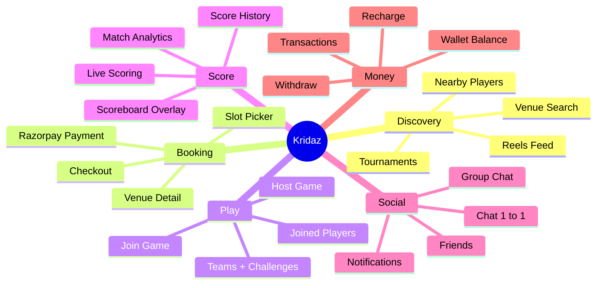

## 2.5 Unique Selling Points

1. **Booking + Hosting + Scoring in one place** — competing apps cover one slice; Kridaz unifies them.
2. **Live scoring with broadcast overlay** — produces shareable artefacts that drive viral loops.
3. **Internal wallet + Razorpay** — supports refunds, split cost, and future P2P payouts without payment-vendor rebuilds.
4. **Nearby player discovery with privacy controls** — opt-in `location_sharing_enabled` + configurable `search_radius_km` per user.
5. **Whitelisted reels** — keeps the content quality bar high during cold start.

## 2.6 Assumptions

- Users have an active internet connection (offline mode is out of scope).
- Phone numbers are India-format (+91 default in OTP flow); international support is planned.
- Razorpay account is in **test** mode for development (`rzp_test_SiJWPw3RX4jJB1`).
- Backend deployment target is **Railway** (`https://prod-api.kridaz.com/api`).
- Push notifications require valid Firebase configuration on both platforms.
- Image and video assets are served via signed/static paths from the FastAPI `files` router.

## 2.7 Constraints

- **Platform:** Flutter SDK `>=3.0.0 <4.0.0`.
- **Backend:** Python 3.x + FastAPI ≥ 0.110, SQLAlchemy 2.0, PostgreSQL.
- **Mobile auth:** Apple Sign-In is **mandatory on iOS** (App Store Guideline 4.8) since Google Sign-In is offered; hidden on Android.
- **Reels:** Creation UI gated behind manual admin approval. Do not surface reel-creation entry points to general users.
- **No backwards-compat shims** for removed product/cart UI; models persist in DB but app routes are pruned.
- **Single canonical API base**: `/api` (the legacy `/api/v1` prefix has been removed in the mobile client config).

---

# 3. System Architecture

## 3.1 Architecture Overview

Kridaz is a **hybrid client–server** product. **This repository owns only the mobile client**; the backend and database are operated by a separate team and are external dependencies.

1. **Flutter Mobile Client** *(this repo)* — UI, local cache, secure token store (Keychain/Keystore), Dio HTTP client, Socket.IO realtime client.
2. **External Backend** *(not in this repo)* — REST + Socket.IO service hosted at `https://prod-api.kridaz.com/api`.
3. **External Database** *(not in this repo)* — managed by backend team.

External services consumed directly by the mobile app: **Firebase (FCM)**, **Razorpay (payments)**, **Google Maps / Places**, **Google Sign-In**, **Apple Sign-In (iOS)**.

## 3.2 Architecture Style

- **Mobile client style:** Layered Flutter app — Screens → Riverpod Providers → Services → Dio / Socket.IO.
- **Backend style:** Out of scope for this document.
- **Communication:**
  - REST/JSON over HTTPS for all CRUD.
  - **Socket.IO / WebSocket** for chat and live scoring.
  - **FCM** for push notifications.

## 3.3 High-Level Architecture Diagram

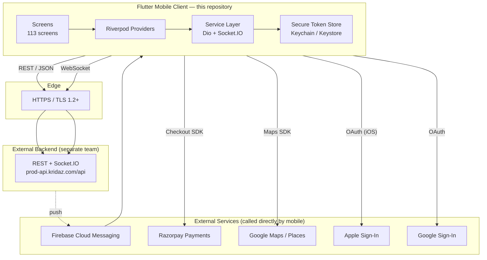

## 3.4 Components

### 3.4.1 Frontend (Flutter)
- **Framework:** Flutter (Material 3, custom theming under `lib/core/theme`).
- **State Management:** **Riverpod** (`flutter_riverpod`, `riverpod_annotation`).
- **Navigation:** **GoRouter** (`lib/router/app_router.dart`) with auth-guarded routes.
- **Networking:** **Dio** with cookie jar, pretty logger (debug), and a custom `AuthInterceptor`. A legacy `http`-based path exists for some services.
- **Realtime:** `socket_io_client` (chat + scoring), `web_socket_channel` (legacy path).
- **Local Persistence:** `shared_preferences` (auth token cold-start), `flutter_secure_storage` (Keychain/Keystore).
- **Forms / UI helpers:** Google Fonts (Poppins), Lucide icons, FL Chart, Table Calendar, QR Flutter.
- **Maps & Location:** `google_maps_flutter`, `geolocator`, `geocoding`, `flutter_map`.
- **Media:** `image_picker`, `video_player`, `cached_network_image`.
- **Payments:** `razorpay_flutter`.
- **Push:** `firebase_core`, `firebase_messaging`.

### 3.4.2 Backend (External)
- Owned by a separate team. Documented here only as a black-box dependency. See §9 for the contract the mobile app expects.

### 3.4.3 APIs
- REST surface consumed at `https://prod-api.kridaz.com/api`.
- Socket.IO/WebSocket for chat and live scoring.

### 3.4.4 Database
- External. The mobile app does not connect to any database directly.

### 3.4.5 Authentication
- **Phone OTP** flow (custom backend OTP, screen: `otp_verification_screen.dart`).
- **Google Sign-In** (`google_sign_in ^6.2.1`).
- **Apple Sign-In** (`sign_in_with_apple ^6.1.0`) — iOS only.
- **Email/Password** (legacy login screen + forgot password).
- Backend issues a JWT-style token, stored in `flutter_secure_storage` and mirrored to `SharedPreferences` via `TokenBridge` for cold-start.

### 3.4.6 Third-Party Integrations
| Integration | Purpose | Library / SDK |
|---|---|---|
| Firebase Cloud Messaging | Push notifications | `firebase_messaging` |
| Razorpay | Payment gateway | `razorpay_flutter` |
| Google Sign-In | OAuth | `google_sign_in` |
| Apple Sign-In | OAuth (iOS) | `sign_in_with_apple` |
| Google Maps + Places | Maps, geocoding | `google_maps_flutter`, `geocoding` |
| WebView | Render legal pages from web | `webview_flutter` |
| Phone Contacts | Invite teammates | `flutter_contacts` |

### 3.4.7 AI Models
None embedded in v1.0. Future hooks reserved for matchmaking ranking, content moderation on reels, and scoring auto-detection (see §12 and §18).

### 3.4.8 Storage Services
- **Object storage:** `buckets/` directory in dev; production target is S3-compatible.
- **Asset categories:** `venue_images/`, `product_images/`, `reels/`, `chat_attachments/`, profile photos.

### 3.4.9 Monitoring Systems
- Backend: stdout structured logs (timestamp, level, method, path, status, latency).
- Mobile: Flutter's `FlutterError.onError` + custom `ErrorWidget.builder` masking stack traces from end users.
- No external APM wired in v1 (recommended: Sentry, see §16).

## 3.5 Data Flow — Sample: Book a Ground

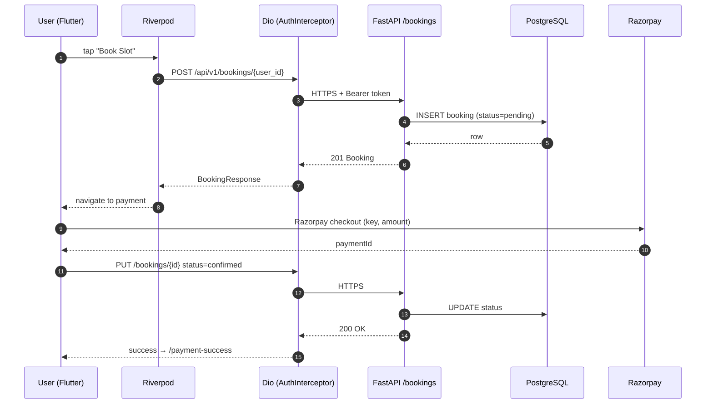

## 3.6 Communication Flow Summary

| Channel | Direction | Use |
|---|---|---|
| HTTPS REST | Client ⇄ API | CRUD, auth, uploads (multipart) |
| Socket.IO | Client ⇄ API | Chat messages, typing indicators, live scoring events |
| FCM | API → Client | Push notifications (friend req, message, game invite, system) |
| Razorpay SDK | Client ⇄ Razorpay | Payment checkout (server verification path is roadmap) |

---

# 4. Functional Requirements

> Numbering: `FR-<Module>-<n>`. Acceptance criteria are stated in Given/When/Then form where useful.

## 4.1 Authentication & Onboarding

### FR-AUTH-1: Phone Number Login (OTP)
- **Description:** User enters phone number, receives OTP, verifies, and lands on profile or home depending on onboarding state.
- **Inputs:** E.164-style phone number, 6-digit OTP.
- **Outputs:** JWT token, `User` row created or refreshed via `/users/sync/{uid}`.
- **Business Logic:** If `onboarding_complete == "false"`, route to onboarding flow.
- **Dependencies:** Backend OTP service, `phone_auth_service.dart`.
- **Acceptance:** Given a valid phone, when correct OTP is entered, then user lands on Home with a valid session.

### FR-AUTH-2: Google Sign-In
- **Description:** OAuth via Google account; syncs profile to backend.
- **Outputs:** `User` upserted (`auth_provider = google`).
- **Dependencies:** `google_sign_in`, `google_auth_service.dart`.

### FR-AUTH-3: Apple Sign-In (iOS only)
- **Description:** Required by App Store guideline 4.8. Hidden on Android.
- **Dependencies:** `sign_in_with_apple`.

### FR-AUTH-4: Email Login + Forgot Password
- **Description:** Legacy email/password path retained for existing users.

### FR-ONB-1: Profile Capture
- Name, DOB, gender, location, sports interests.

### FR-ONB-2: Location Permission & Sharing Preference
- **Inputs:** Geo permission, `location_sharing_enabled`, `search_radius_km` (default 25).
- **Outputs:** Updated `users` row.

## 4.2 Venue & Booking

### FR-VEN-1: Browse Venues
- **Inputs:** Optional `city`, `sport`, pagination.
- **Outputs:** List of venues, ordered by `rating` desc.

### FR-VEN-2: Venue Detail
- Display photos, amenities, sports, pricing, hours, rating.

### FR-BK-1: Slot Selection
- **Inputs:** Selected date, sport, court.
- **Logic:** Render available time slots based on `opening_time`–`closing_time` and existing bookings.

### FR-BK-2: Checkout & Payment
- **Inputs:** Slot, duration, price.
- **Outputs:** `Booking` row (status `pending` → `confirmed` after Razorpay success).

### FR-BK-3: Booking Cancellation
- **Logic:** Transition booking to `cancelled`; refund routed via wallet (manual in v1).

### FR-BK-4: Past / Upcoming Bookings
- Server filters by `status`.

## 4.3 Games

### FR-GAME-1: Host a Game
- **Inputs:** Sport, date, time, venue or custom location with coords, max players, skill, gender, age group, price split.
- **Logic:** Host auto-added to `player_ids`, `current_players = 1`, `status = upcoming`.

### FR-GAME-2: Browse / Join Games
- Filters: `sport`, `status`, `skill_level`, `game_type`. Upcoming-only by default.

### FR-GAME-3: Join / Leave a Game
- **Logic:** Increment/decrement `current_players`; transition to `full` when `current_players == max_players`.

### FR-GAME-4: Host View (Manage Players)
- Roster, kick player, mark complete.

### FR-GAME-5: Cost Splitting
- If `split_cost == true` and `total_cost > 0`, per-player cost = `total_cost / current_players` (computed client-side; persisted on join).

## 4.4 Live Scoring

### FR-SC-1: Start Live Cricket Match
- **Inputs:** Teams, players, toss decision, overs.
- **Outputs:** Match state object pushed over WebSocket.

### FR-SC-2: Real-Time Scorecard
- Subscribers receive ball-by-ball updates via Socket.IO.

### FR-SC-3: Broadcast Overlay
- A transparent overlay screen suitable for OBS / streaming software.

### FR-SC-4: Score History
- Persisted scorecards browsable per player.

### FR-SC-5: Match Analytics
- Per-player aggregates rendered with `fl_chart`.

## 4.5 Teams

### FR-TEAM-1: Create & Manage Team
- Roster from friends or phone contacts.

### FR-TEAM-2: Team Pass (QR)
- Generate QR pass for entry verification (`qr_flutter`, save PNG via `path_provider`).

### FR-TEAM-3: Challenge Another Team
- Sends a `team_opponent_request` (model present).

## 4.6 Social — Chat & Friends

### FR-CHAT-1: 1:1 Conversation
- WebSocket-backed; messages persisted in `messages` table; conversation tracked in `conversations`.

### FR-CHAT-2: Group Chat
- Create / edit groups, member management, group info.

### FR-CHAT-3: Media Sharing
- Image / file attachments via `image_picker` + multipart upload.

### FR-CHAT-4: Forwarding
- Forward a message to another conversation.

### FR-FRD-1: Friend Requests
- Send, accept, reject, block; states from `FriendshipStatus` enum.

### FR-FRD-2: My Friends, Pending Requests
- Paginated views.

### FR-FRD-3: Nearby Players
- Geo search bounded by per-user `search_radius_km`; only includes users with `location_sharing_enabled = true`.

## 4.7 Reels

### FR-REEL-1: Feed
- Public feed of approved reels, sorted by recency.

### FR-REEL-2: Like / Comment
- Persisted in `reel_likes`, `reel_comments`.

### FR-REEL-3: Upload (Whitelisted Only)
- Upload UI is **gated** — surfaced only for whitelisted accounts. *See `[[project_reels_whitelist]]`.*

## 4.8 Wallet & Payments

### FR-WAL-1: Wallet Balance
- Auto-created with `balance = 0` on first `users` create / sync.

### FR-WAL-2: Recharge
- Razorpay flow → `Transaction(type=credit, status=success)`.

### FR-WAL-3: Withdraw
- Submits request; manual ops settles in v1.

### FR-WAL-4: Transaction History
- Paginated list.

## 4.9 Notifications

### FR-NOT-1: In-App Panel
- List of `notifications` rows with read/unread state.

### FR-NOT-2: Push Delivery
- FCM token registered on app start; server fans out events of type `FRIEND_REQUEST`, `FRIEND_ACCEPTED`, `NEW_MESSAGE`, `GAME_INVITE`, `SYSTEM`.

## 4.10 Tournaments

### FR-TOUR-1: List, Detail, Create
- v1 supports listing & creation UI; server persistence reuses `Game` model with `game_type = tournament`.

## 4.11 Apply As Coach / Academy

### FR-PRO-1: Application Submission
- Captures professional credentials and documents (image upload).
- State transitions to `application_under_review_screen` post-submit.

## 4.12 Force Update

### FR-SYS-1: Version Gate
- `core/version/version_state.dart` exposes a force-update screen when the server flags the running client as unsupported.

---

# 5. Non-Functional Requirements

## 5.1 Performance (Mobile-side targets)

| Metric | Target | Notes |
|---|---|---|
| Cold start (mobile) | < 2.5 s on mid-range Android | Splash + token rehydrate |
| First meaningful frame on Home | < 1.5 s after auth | After token validation |
| Booking flow → success | < 90 s p50 | End-to-end including Razorpay |
| Frame budget | 16 ms (60 fps) | No jank on scroll in feeds/reels |

Backend latency targets (read/write/WS) are owned by the backend team.

## 5.2 Security (Mobile-side)

- **Token storage:** JWT in `flutter_secure_storage` (Keychain on iOS, Keystore on Android).
- **Transport:** HTTPS only; planned cert pinning for `prod-api.kridaz.com`.
- **Secrets:** Razorpay key id injected via `--dart-define` (no defaults). Firebase config files must be in `.gitignore` for production secrets, or rotated if leaked.
- **PII the app handles:** phone, email, DOB, location, photo, contacts (when invited), chat content.
- **Stack-trace leakage:** `ErrorWidget.builder` replaces Flutter's red screen with a generic message.

## 5.3 Reliability (Mobile-side)

- **Fault tolerance:** 401 from any endpoint triggers a safe logout via `AuthInterceptor`; widget-tree exceptions caught by `ErrorWidget.builder`.
- **Offline behaviour:** Out of scope for v1; the app requires network connectivity. Network state surfaced via `connectivity_service.dart`.
- **Force update:** `core/version/version_state.dart` can gate users off an unsafe client version when the backend signals it.

## 5.4 Usability

- Material 3 + custom `app_colors` and `premium_gradients`.
- Poppins font system-wide for visual coherence.
- One-handed reach: bottom navigation in `main_container.dart`.
- Accessibility roadmap: high-contrast theme, screen-reader semantics audit (see §18).

## 5.5 Maintainability

- Riverpod separates UI from logic; providers act as testable seams.
- Feature-folder organization (`screens/`, `services/`, `providers/`, `models/`).
- Backend routers are one-per-domain (`users.py`, `games.py`, …) — fast to navigate.
- Lints via `flutter_lints ^6.0.0`.
- Code-gen via `freezed`, `json_serializable`, `riverpod_generator`.

## 5.6 Availability

- **Target:** 99.5 % monthly (v1), 99.9 % post-PMF.
- **Single point of failure:** PostgreSQL primary (Railway managed; HA upgrade required pre-launch).
- **Static assets** served from the FastAPI process (`/files`) — recommended migration to CDN-fronted S3.

## 5.7 Scalability

- Mobile is inherently horizontal (one process per device). Backend/storage scaling is owned by the backend team.

## 5.8 Compliance

- **App Store:** Sign-in with Apple alongside Google (4.8) — implemented.
- **Google Play:** Data Safety form must declare PII (phone, location, photo).
- **DPDP Act (India):** Capture explicit consent for location sharing; provide data deletion route (legal WebView screen exists).

---

# 6. User Roles and Permissions

Kridaz currently uses **implicit role inference** (a user is a host because they created a game; a user is a captain because they created a team). The recommended forward model adds explicit roles.

## 6.1 RBAC Matrix

| Role | Permissions | Restrictions |
|---|---|---|
| **Guest (Unauthenticated)** | View splash, login screens, legal WebViews | Cannot read user data, list games, book |
| **User (Player)** | Browse venues, book, host/join games, chat, manage own friends/teams/wallet, view reels | Cannot upload reels (unless whitelisted), cannot manage other users' data |
| **Game Host** *(contextual)* | Edit own game, manage roster, mark complete, cancel | Only games where `host_id == user.uid` |
| **Team Captain** *(contextual)* | Manage team roster, issue team pass, send challenges | Only teams they created |
| **Scorer** | Run live scoring for an assigned match | Cannot retroactively edit final scorecards (target) |
| **Coach / Academy (Approved)** | Listed in Pros, receive bookings | Application must be approved |
| **Whitelisted Creator** | Upload reels | Subject to content moderation |
| **Moderator** *(planned)* | Hide reels, ban users, resolve disputes | Read-only on financials |
| **Admin** | All read, approve creators, approve pros, manage venues, force-update gates | — |
| **Super Admin** | All admin + manage admin roster, environment toggles | — |

> **Note:** The current backend does not enforce role checks at the endpoint layer. Server-side RBAC enforcement is a **must-fix before public launch** (see §13 and §17).

## 6.2 Permission Examples

| Action | Guest | User | Host | Captain | Whitelisted | Admin |
|---|:-:|:-:|:-:|:-:|:-:|:-:|
| Browse venues | ✗ | ✓ | ✓ | ✓ | ✓ | ✓ |
| Book venue | ✗ | ✓ | ✓ | ✓ | ✓ | ✓ |
| Host game | ✗ | ✓ | ✓ | ✓ | ✓ | ✓ |
| Edit *another's* game | ✗ | ✗ | ✗ | ✗ | ✗ | ✓ |
| Upload reel | ✗ | ✗ | ✗ | ✗ | ✓ | ✓ |
| Approve coach application | ✗ | ✗ | ✗ | ✗ | ✗ | ✓ |
| Hide reel | ✗ | ✗ | ✗ | ✗ | ✗ | ✓ |
| Force-update toggle | ✗ | ✗ | ✗ | ✗ | ✗ | ✓ |

---

# 7. User Flow Documentation

## 7.1 New User → First Booking

```mermaid
flowchart LR
    A[Splash] --> B{Token?}
    B -- no --> C[Welcome / Login]
    C --> D[Phone or Google or Apple]
    D --> E[OTP Verify]
    E --> F[User Info]
    F --> G[Gender]
    G --> H[Interests / Sports]
    H --> I[Location Permission]
    I --> J[Home Dashboard]
    B -- yes --> J
    J --> K[Search / Venue List]
    K --> L[Venue Detail]
    L --> M[Date Picker]
    M --> N[Time Slot]
    N --> O[Checkout]
    O --> P[Razorpay]
    P --> Q[Payment Success]
    Q --> R[Booking Detail]
```

## 7.2 Host a Game

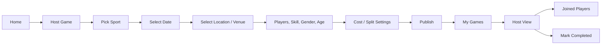

## 7.3 Join a Game

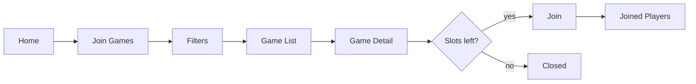

## 7.4 Live Scoring

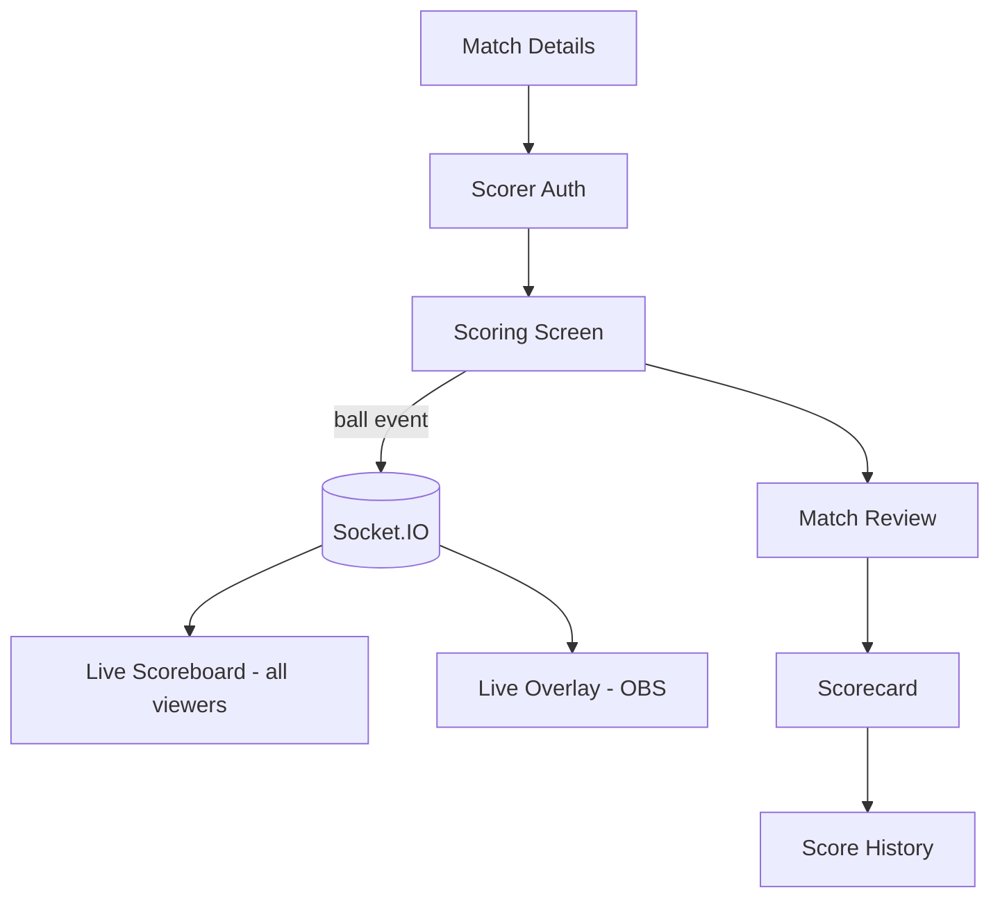

## 7.5 Chat — Send a Message

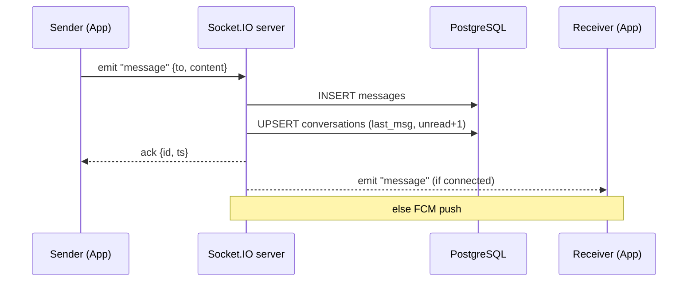

## 7.6 Friend Request

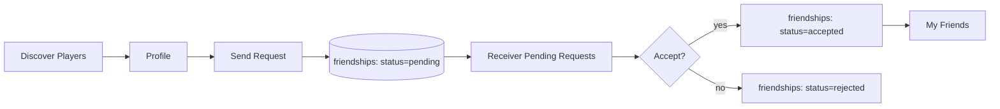

## 7.7 Wallet Recharge

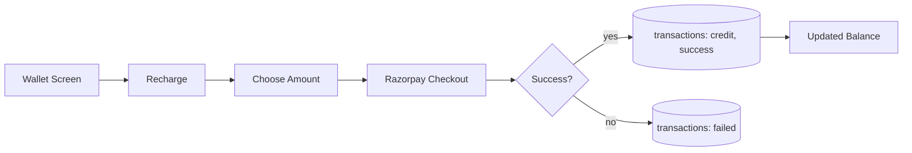

---

# 8. Data Model (Mobile-Side)

> The persistent relational database is owned by the external backend team. The mobile app neither defines nor migrates that schema. This section documents only the **data shapes the mobile app handles** — local storage, in-memory models, and the entities returned by the API contract.

## 8.1 Mobile Local Storage

| Store | Mechanism | Purpose |
|---|---|---|
| Secure Token Store | `flutter_secure_storage` (Keychain on iOS, Keystore on Android) | JWT bearer token |
| SharedPreferences | `shared_preferences` | Cold-start token mirror (`auth_token`), onboarding flags, theme preference, location filter cache |
| Cookie Jar | `cookie_jar` + `dio_cookie_manager` | Session cookies for legacy endpoints |
| Cache | `cached_network_image` | Image disk cache |
| Temp Files | `path_provider` | Team Pass PNGs, picked images/videos before upload |

## 8.2 In-App Domain Models

Defined under `lib/models/` and consumed by Riverpod providers and Dio services. The list below names the model + the conceptual fields the UI binds to; exact JSON shape is dictated by the external backend.

| Model file | Conceptual entity | Notable fields |
|---|---|---|
| `user_model.dart`, `user_profile.dart`, `user_profile_data.dart` | Current user / other profile | `uid`, `displayName`, `photoUrl`, `phone`, `email`, `sports[]`, `interests[]`, `lat`/`lng`, `locationSharingEnabled`, `searchRadiusKm`, `onboardingComplete` |
| `address_model.dart` | Saved address | `name`, `mobile`, `pincode`, `houseNumber`, `address`, `locality`, `city`, `state`, `type`, `isDefault` |
| `venue_model.dart`, `ground_model.dart`, `turf_model.dart`, `court_model.dart` | Venue + sub-courts | `id`, `name`, `address`, `city`, `lat`/`lng`, `imageUrls[]`, `sportsAvailable[]`, `amenities[]`, `pricePerHour`, `rating`, `openingTime`, `closingTime`, `totalCourts` |
| `slot_model.dart`, `time_slot_model.dart` | Bookable slot | `startTime`, `endTime`, `duration`, `price`, `isAvailable` |
| `booking_model.dart` | Booking | `id`, `sport`, `venueName`, `venueAddress`, `date`, `start`, `end`, `duration`, `price`, `status` |
| `team_model.dart`, `team_opponent_request_model.dart` | Team + challenge | `id`, `name`, `captainUid`, `members[]`, `sport` |
| `official_model.dart` | Match official | role, contact, sport |
| `pending_match_model.dart` | Inbox match invite | `gameId`, `hostId`, `expiresAt` |
| `scoring_models.dart` | Live scoreboard | innings, batters, bowlers, balls, extras, wickets |
| `media_item_model.dart`, `story_model.dart`, `post_model.dart` | Reels / stories / posts | `videoUrl`, `thumbnailUrl`, `caption`, `sport`, counts |
| `chat_model.dart`, `message_model.dart` | Chat & message | `conversationId`, `senderUid`, `receiverUid`, `text`, `messageType`, `fileUrl`, `isRead`, `createdAt` |

## 8.3 Logical Entity Relationships (as seen by the client)

This reflects how the **mobile app** wires entities together for navigation and state; the source-of-truth schema is the backend's responsibility.

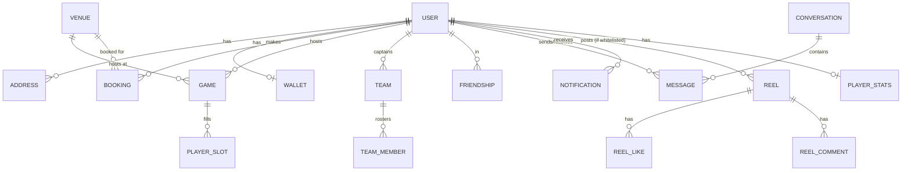

## 8.4 Local-Persistence Lifecycle

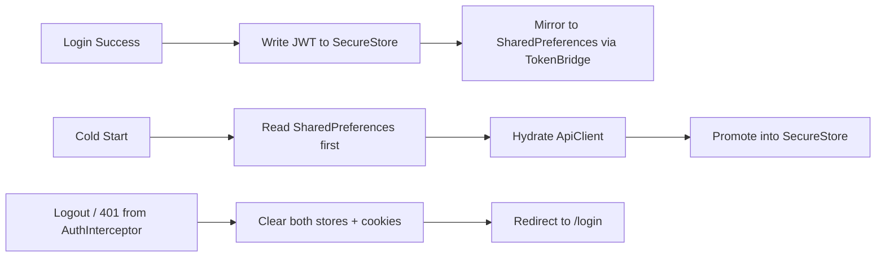

---

# 9. External Backend — API Contract Consumed by the App

> **Ownership note.** The backend is **not** in this repository. It is operated by a separate team. This section documents the contract as **observed and required by the mobile app**, derived from `lib/services/*` and `lib/core/network/*`. The authoritative API reference lives with the backend team's OpenAPI document.

## 9.1 Conventions Required by the Mobile Client

- **Base URL (prod):** `https://prod-api.kridaz.com/api` (configurable via `lib/config/api_config.dart`).
- **Versioning:** The mobile client currently calls the **`/api`** base. The backend team should expose the canonical `/api/v1` prefix and the mobile config should be flipped to match — see §17.
- **Auth:** `Authorization: Bearer <jwt>` attached by `AuthInterceptor`. Backend is expected to issue a JWT (or opaque bearer) at login and accept it on every authenticated request.
- **Content type:** `application/json` for most calls; `multipart/form-data` for uploads.
- **Pagination:** `skip` + `limit` query params (max 100).
- **Custom request header:** `X-Request-Id` (UUID, generated client-side via `uuid` package) — required for distributed tracing.
- **Error envelope expected by the client:** `{ "detail": ..., "message": "..." }`.

## 9.2 Endpoints the Mobile App Calls

The Flutter service classes under `lib/services/` hit the endpoints below. Confirm exact paths and payloads with the backend team's OpenAPI doc — these reflect mobile-side expectations.

### Users
- `POST /users` — register
- `POST /users/sync/{uid}` — upsert after OAuth
- `GET /users/{uid}` — fetch profile
- `PUT /users/{uid}` — update profile
- `GET /users/email/{email}`, `GET /users/phone/{phone}` — lookups

### Venues / Grounds / Turfs
- `GET /venues?city=&sport=&is_active=true&skip=&limit=`
- `GET /venues/{id}`

### Games
- `POST /games/{user_id}` — host
- `GET /games?sport=&status=&skill_level=&game_type=`
- `GET /games/{id}`
- `POST /games/{id}/join/{user_id}`, `POST /games/{id}/leave/{user_id}`
- `PUT /games/{id}`, `POST /games/{id}/complete`

### Bookings
- `POST /bookings/{user_id}`
- `GET /bookings/{user_id}?status_filter=`
- `GET|PUT|DELETE /bookings/{user_id}/{booking_id}`

### Wallet
- `GET /wallet/{user_id}`
- `GET /wallet/{user_id}/transactions`
- `POST /wallet/{user_id}/recharge`, `/withdraw`

### Addresses, Friends, Messages, Notifications, Reels, Player Stats
- Same REST conventions; see corresponding `lib/services/*_service.dart` for exact bodies the client sends.

### Realtime
- **Socket.IO chat namespace** under `/chat` — events: `connect`, `message`, `typing`, `read`.
- **Live scoring** WebSocket — events `match.start`, `match.ball`, `match.state`, `match.end`.

### Files / Uploads
- `POST /upload` (multipart) and `GET /files/...` for serving (URLs are server-generated).

## 9.3 Client-Side Robustness for Backend Unreliability

The mobile app makes these defensive assumptions:

| Concern | Client behavior |
|---|---|
| 401 from any endpoint | `AuthInterceptor` clears tokens and routes to `/login` |
| 5xx | Surfaces a calm snackbar; logs to console; does not retry blindly |
| Validation 422 | Maps `detail[]` to field-level form errors where possible |
| Timeout | 30s connect / 30s receive (`ApiConfig.connectTimeout` / `receiveTimeout`) |
| Stack-trace leak | `ErrorWidget.builder` replaces Flutter's red screen with a generic message |

## 9.3 Sample Endpoint Specs

### POST `/api/v1/games/{user_id}` — Host a Game

**Headers**
```
Authorization: Bearer <jwt>
Content-Type: application/json
```

**Request body** (`GameCreate`)
```json
{
  "venue_id": "uuid-or-null",
  "location": "Karkhana Ground, Hyderabad",
  "latitude": 17.4485,
  "longitude": 78.5050,
  "sport": "cricket",
  "title": "Sunday Friendly",
  "description": "Soft ball, 8 overs each",
  "date": "2026-06-15T00:00:00Z",
  "start_time": "07:00",
  "end_time": "09:00",
  "duration": 120,
  "min_players": 6,
  "max_players": 12,
  "game_type": "public",
  "game_mode": "friendly",
  "skill_level": "any",
  "gender_preference": "mixed",
  "age_group": "18-35",
  "price_per_person": 150,
  "total_cost": 1800,
  "is_free": false,
  "split_cost": true,
  "rules": "No spikes",
  "required_equipment": ["bat", "ball"]
}
```

**Success 201** (`GameResponse`)
```json
{
  "id": "5f2…",
  "host_id": "user_…",
  "current_players": 1,
  "player_ids": ["user_…"],
  "status": "upcoming",
  "...": "all fields above"
}
```

**Errors**
- 400 — neither `venue_id` nor `location` provided.
- 404 — user or venue not found.
- 422 — validation error.

### POST `/api/v1/bookings/{user_id}` — Create Booking

**Request**
```json
{
  "sport": "cricket",
  "venue_name": "Saavik Turf",
  "venue_address": "Hyderabad",
  "venue_image_url": "venue_images/saavik.jpg",
  "date": "2026-06-15T00:00:00Z",
  "start_time": "07:00",
  "end_time": "08:00",
  "duration": 60,
  "price": 800
}
```

**Success 201** — `BookingResponse` with `status: "pending"`.

### GET `/api/v1/venues` — List Venues

| Param | Type | Default | Notes |
|---|---|---|---|
| skip | int | 0 | ≥ 0 |
| limit | int | 20 | 1–100 |
| city | string | — | ILIKE `%city%` |
| sport | string | — | array contains |
| is_active | bool | true | |

**Response 200** — array of `VenueResponse`.

## 9.4 WebSocket Events (Chat)

| Event | Direction | Payload |
|---|---|---|
| `connect` | C→S | `{ token }` |
| `message` | C→S | `{ to, content, message_type, file_url? }` |
| `message` | S→C | full `Message` row |
| `typing` | C↔S | `{ to, isTyping }` |
| `read` | C→S | `{ message_ids: [] }` |

## 9.5 WebSocket Events (Live Scoring)

| Event | Payload |
|---|---|
| `match.start` | `{ matchId, teams, overs, toss }` |
| `match.ball` | `{ runs, extras, wicket, over, ball }` |
| `match.state` | snapshot of full scorecard |
| `match.end` | `{ winner, mom, summary }` |

---

# 10. Frontend Documentation

## 10.1 Top-Level Layout

```
lib/
├── config/api_config.dart        # environment + base URL switch
├── core/
│   ├── clock/                    # server clock sync
│   ├── constants/                # colors, gradients, typography
│   ├── di/                       # core providers (Riverpod)
│   ├── error/                    # error mapping
│   ├── network/                  # Dio client, interceptors, ApiClient
│   ├── storage/                  # secure token store + token bridge
│   ├── theme/                    # theme packs (incl. scoring overlays)
│   ├── util/, utils/             # helpers
│   └── version/                  # force-update state
├── data/, domain/, presentation/ # newer Clean Architecture layers
├── firebase_options.dart
├── main.dart
├── models/                       # legacy domain models
├── providers/                    # Riverpod providers
├── router/app_router.dart        # GoRouter config
├── screens/                      # 113 screens
├── services/                     # API + integration services
└── widgets/                      # shared UI components
```

## 10.2 Screens (selected — 113 total)

| Module | Screens |
|---|---|
| Auth & Onboarding | `splash_screen`, `bms_welcome_screen`, `bms_login_screen`, `phone_auth_screen`, `otp_verification_screen`, `register_screen`, `forgot_password_screen`, `user_info_screen`, `bms_screen_04_gender`, `bms_screen_05_interests`, `bms_screen_06_loading`, `sports_interests_screen`, `pick_sports_screen` |
| Home / Container | `main_container`, `new_home_dashboard`, `new_search_screen`, `select_location_screen`, `select_location_filter_screen`, `home/*` |
| Venue Booking | `ground_onboarding_screen`, `ground_detail_screen`, `ground_booking_date_screen`, `ground_booking_timeslot_screen`, `ground_booking_checkout_screen`, `ground_booking_payment_screen`, `ground_booking_success_screen`, `booking_detail_screen`, `booking_cancellation_screen`, `pastupcomingbookings`, `write_review_screen`, `raise_dispute_screen` |
| Games | `host_game_screen`, `games_screen`, `join_games_screen`, `join_game_detail_screen`, `join_game_info_screen`, `join_game_host_view_screen`, `game_details_screen`, `joined_players_screen`, `my_games_screen` |
| Live Scoring | `scoring/`, `scoring_screen`, `scorecard_screen`, `score_history_screen`, `live_scoreboard_screen`, `live_overlay_screen`, `match_review_screen`, `match_details_screen`, `match_analytics_screen`, `match_view/*`, `stream_setup_screen` |
| Teams | `my_teams_screen`, `team_detail_screen`, `team_members_screen`, `team_pass_screen`, `challenge_team_screen`, `create_group_screen`, `edit_group_screen`, `group_info_screen` |
| Social — Chat | `conversations_screen`, `chat_screen`, `chat_media_screen`, `chat_user_profile_screen`, `messages_screen`, `forward_message_screen`, `select_contacts_screen` |
| Social — Friends | `add_friends_screen`, `my_friends_screen`, `pending_requests_screen`, `discover_players_screen`, `nearby_players_home_screen`, `nearby_players_search_screen`, `nearby_players_settings_screen`, `player_profile_screen`, `user_profile_detail_screen`, `community_screen` |
| Reels | `reels_screen`, `reel_community_view`, `reel_upload_screen`, `story_upload_screen` |
| Wallet & Payments | `wallet_screen`, `recharge_wallet_screen`, `withdraw_money_screen`, `transaction_history_screen`, `payment_screen`, `payment_success_screen` |
| Notifications | `notification_panel_screen` |
| Tournaments | `tournaments_screen`, `tournament_detail_screen`, `tournament_create_screen` |
| Professionals | `professionals_screen`, `professional_detail_screen`, `professional_payment_screen`, `professional_payment_success_screen`, `pros_filter_sheets`, `apply_as_coach_screen`, `apply_as_academy_screen`, `application_under_review_screen` |
| Misc / System | `legal_webview_screen`, `force_update_screen`, `signature_screen`, `address_screen`, `location_settings_screen`, `leaderboard_screen`, `blogs_screen`, `saved_items_screen`, `theme_preview_screen`, `dev/*` |

## 10.3 State Management (Riverpod)

| Provider | Responsibility |
|---|---|
| `auth_provider.dart` | Auth state, token rehydrate |
| `user_provider.dart` | Current user profile |
| `home_actions_provider.dart` | Home dashboard quick actions |
| `host_game_provider.dart` | Game hosting form state |
| `location_provider.dart` | Geo location + permissions |
| `navigation_provider.dart` | Tab + bottom-nav state |
| `notification_provider.dart` | In-app + push notification stream |
| `pending_matches_provider.dart` | Match invitations |
| `reel_upload_provider.dart` | Upload progress & metadata |
| `reels_feed_provider.dart` | Paginated reels feed |
| `story_provider.dart` | Stories feed |
| `team_provider.dart` | Team CRUD |

## 10.4 Routing

`GoRouter` in `lib/router/app_router.dart` defines named routes covering all screens. A redirect predicate consults `AuthManager` and `VersionState`:

```mermaid
flowchart TD
    R[GoRouter.redirect] --> V{Force update?}
    V -- yes --> FU[/force-update]
    V -- no --> A{Authed?}
    A -- no --> L[/login]
    A -- yes --> O{Onboarded?}
    O -- no --> ON[/onboarding/*]
    O -- yes --> H[/home]
```

## 10.5 Forms & Validation

- Field-level validation in screens (e.g. phone format, age ≥ 13, OTP length).
- Server-side validation via Pydantic (422 surfaces under `detail[]`).

## 10.6 UI Libraries / Design

- **Theme:** Material 3, `app_colors.dart`, `premium_gradients.dart`.
- **Typography:** Poppins via `google_fonts`.
- **Icons:** Lucide (parity with web), `cupertino_icons`, `flutter_svg`.
- **Charts:** `fl_chart`.
- **Calendar:** `table_calendar`.
- **QR:** `qr_flutter` (Team Pass).

## 10.7 Component Hierarchy (Home Dashboard)

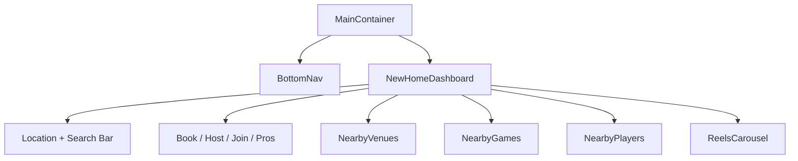

---

# 11. Mobile Networking Layer

> The backend is external (§9). This section documents the **mobile-side** networking architecture — Dio client, interceptors, services, and how realtime is wired.

## 11.1 Layered Networking Stack

```
lib/
├── config/api_config.dart              # base URL switch + timeouts + Razorpay key
├── core/network/
│   ├── api_client.dart                 # Dio singleton + DI
│   └── interceptors/auth_interceptor.dart  # bearer attach + 401 handling
├── core/storage/
│   ├── secure_token_store.dart         # Keychain/Keystore wrapper
│   └── token_bridge.dart               # SharedPreferences ↔ SecureStore sync
├── services/
│   ├── api_service.dart                # legacy Dio (being retired)
│   ├── auth_manager.dart               # auth state, sign-out, route gating
│   ├── chat_socket_service.dart        # Socket.IO chat client
│   ├── scoring_socket_service.dart     # Live scoring socket
│   └── *_api_service.dart, *_service.dart  # per-domain REST wrappers
```

## 11.2 Request Flow

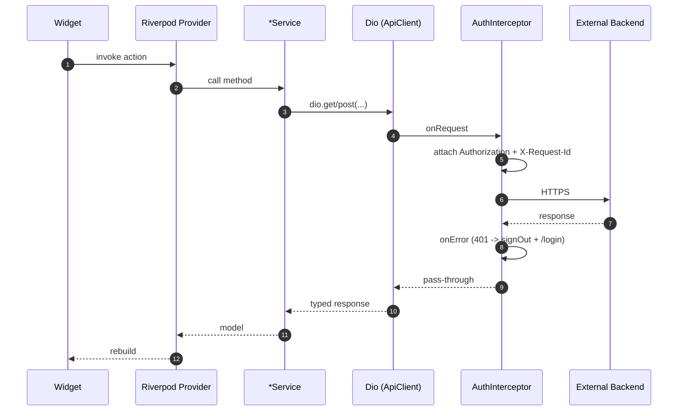

## 11.3 Services ↔ Endpoints

| Service file | Backend endpoints called |
|---|---|
| `user_api_service.dart`, `user_service.dart` | `/users`, `/users/sync/{uid}` |
| `auth_manager.dart`, `phone_auth_service.dart`, `google_auth_service.dart`, `apple_auth_service.dart` | OAuth flows + token issuance |
| `venue_api_service.dart`, `turf_service.dart` | `/venues` |
| `booking_service.dart` | `/bookings/*` |
| `game_service.dart` | `/games/*` |
| `team_service.dart` | `/teams/*` |
| `friends_service.dart` | `/friends/*` |
| `chat_service.dart`, `chat_socket_service.dart` | `/messages/*`, `/chat` (WS) |
| `notifications_service.dart`, `push_notification_service.dart` | `/notifications/*`, FCM |
| `reel_api_service.dart` | `/reels/*` (read for all, write whitelisted) |
| `wallet_service.dart` | `/wallet/*` |
| `address_api_service.dart` | `/addresses/*` |
| `scoring_service.dart`, `scoring_socket_service.dart` | scoring REST + WS |
| `streaming_service.dart` | stream setup endpoints |
| `professionals_service.dart` | pros listing |
| `review_service.dart` | venue/coach reviews |
| `match_feed_service.dart`, `community_service.dart`, `story_service.dart`, `content_services.dart` | feeds / stories |
| `location_service.dart`, `google_places_service.dart`, `connectivity_service.dart` | device + Google integrations (no backend) |
| `image_storage_service.dart` | `/upload` (multipart) |

## 11.4 Error Handling on the Client

- **HTTP layer:** Dio errors are caught in each service and re-thrown as typed exceptions (or `null` for non-fatal failures).
- **401 handling:** `AuthInterceptor` clears the token bridge, calls `AuthManager.signOut()`, surfaces a snackbar via `rootScaffoldMessengerKey`, and lets GoRouter's redirect push to `/login`.
- **UI fallback:** `ErrorWidget.builder` in `main.dart` masks any widget-tree exception with a generic "Something went wrong" panel — prevents stack traces leaking on screen.
- **Force update:** `core/version/version_state.dart` watches a backend-supplied minimum version; mismatch routes to `force_update_screen`.

## 11.5 Realtime

- **Chat:** `chat_socket_service.dart` connects to `${ApiConfig.socketUrl}/chat` with the bearer token. Reconnect with exponential backoff. Outgoing messages also enqueued for delivery once reconnected.
- **Scoring:** `scoring_socket_service.dart` joins per-match rooms; emits ball events, listens for state snapshots.
- **Push (FCM):** `push_notification_service.dart` registers the FCM token with `/notifications/register-token`, handles foreground messages and tap deep-links.

---

# 12. AI/ML Module Documentation

**v1.0 ships without an embedded ML pipeline.** The following hooks are recommended for the next horizon:

| Capability | Approach | Inputs | Output |
|---|---|---|---|
| Game matchmaking | Lightweight ranker over `player_stats` + `skill_level` | sport, recent activity, geo | Ranked candidates for a host's open slot |
| Content moderation (reels) | Off-the-shelf API (Cloud Vision SafeSearch) | thumbnail + first frame | block / allow |
| Toxicity detection (chat) | Perspective API or open-source model | message text | flag → moderation queue |
| Scoring auto-fill (video) | Cricket ball-tracking model | overlay frames | confidence score event |

**Safety Measures (when introduced):**
- Human-in-the-loop for any auto-moderation that hides content.
- Explainability surface in the moderation admin tool.
- A bias review pre-launch for matchmaking ranker.

---

# 13. Security Documentation

## 13.1 Authentication Flow (Phone OTP)

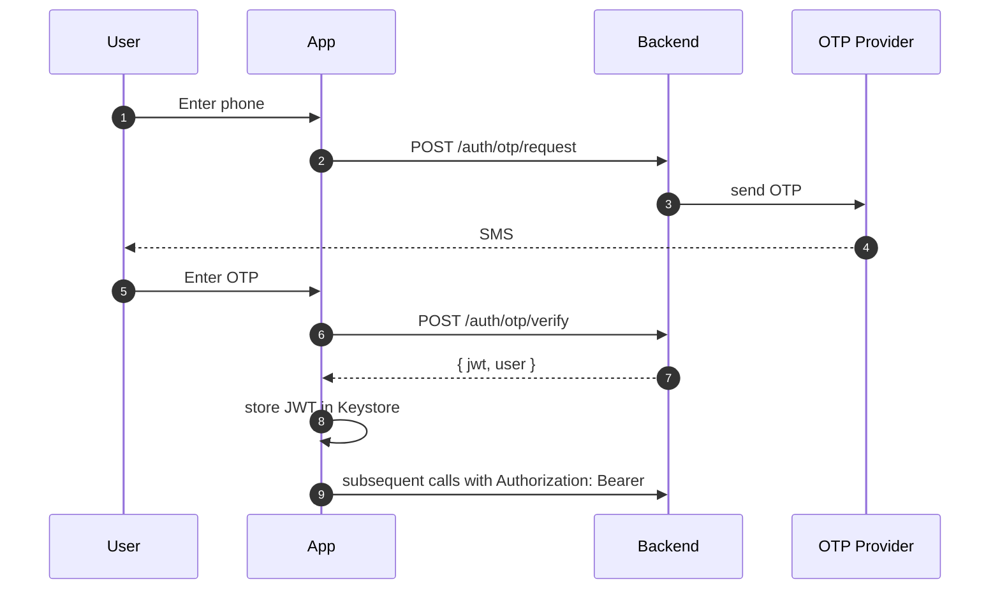

## 13.2 Authentication Flow (Google / Apple)

1. Client invokes platform SDK → returns ID token.
2. Client calls `POST /api/v1/users/sync/{uid}` with profile fields.
3. Backend upserts user, returns API token.

## 13.3 Token Storage on Client

- Primary: `flutter_secure_storage` → Keychain (iOS) / EncryptedSharedPreferences (Android).
- Mirror: `SharedPreferences` for cold-start; bridged by `TokenBridge.bind` in `main.dart`.
- Forced logout: handled by `AuthInterceptor` via `rootScaffoldMessengerKey` snackbar + `AuthManager.signOut`.

## 13.4 Data Encryption

| At rest | In transit |
|---|---|
| PostgreSQL (managed encryption) | TLS 1.2+ |
| Keychain/Keystore (tokens) | WSS for Socket.IO |
| Object storage (recommend SSE-S3) | HTTPS for file fetches |

## 13.5 OWASP Mobile Top 10 — Mobile-Side Status

> Server-side API hardening (OWASP API Top 10) is the backend team's responsibility. The risks below are the ones the **mobile app** owns.

| Risk | Status | Mitigation |
|---|---|---|
| M1 Improper Credential Usage | ✓ JWT in `flutter_secure_storage` (Keychain/Keystore) | Continue avoiding token in plain `SharedPreferences` after bridge retirement |
| M2 Inadequate Supply Chain Security | ⚠ Many third-party packages | Pin versions in `pubspec.yaml`; review changelogs |
| M3 Insecure Authentication / Authorization | ✓ Bearer attached by interceptor; 401 routes to `/login` | Add cert pinning before launch (recommended) |
| M4 Insufficient Input/Output Validation | partial | Form-level validation present; widen for free-text fields |
| M5 Insecure Communication | ✓ HTTPS only (`prod-api.kridaz.com`) | Disallow plaintext via Android `networkSecurityConfig` |
| M6 Inadequate Privacy Controls | ✓ Per-user `locationSharingEnabled`, `searchRadiusKm` | Add explicit consent UI for FCM, contacts |
| M7 Insufficient Binary Protections | ⚠ No obfuscation | Build with `--obfuscate --split-debug-info` for release |
| M8 Security Misconfiguration | ⚠ Razorpay key was in source (**fixed** — see §13.6) | Continue secrets-out-of-source discipline |
| M9 Insecure Data Storage | ✓ Token in secure store, cached images in standard caches | Avoid storing chat attachments to gallery without user action |
| M10 Insufficient Cryptography | n/a (rely on platform TLS) | No bespoke crypto |

## 13.6 Razorpay Key (Resolved)

Previously hardcoded in `lib/config/api_config.dart`. Now read from `--dart-define=RAZORPAY_KEY_ID=...`; `ApiConfig.assertConfigured()` fires at app start to fail loudly if missing. CI must inject the live key for release builds.

## 13.6 Sensitive Data Inventory

- PII: phone, email, DOB, age, gender, location, photo, contact list (when invited).
- Financial: wallet balance, transactions, Razorpay payment IDs.
- Behavioral: chat messages, friend graph, game history.

## 13.7 Vulnerability Assessment Recommendations

- Static analysis: `bandit` (Python), `flutter analyze`.
- Dependency scanning: `pip-audit`, `pubspec` advisories.
- Secrets scanning: `gitleaks` in CI.
- Mobile: `MobSF` for APK/IPA scans.
- Annual third-party pen-test once user count exceeds 10 k.

---

# 14. Deployment Documentation

## 14.1 Environments

| Env | API URL | Notes |
|---|---|---|
| Production | `https://prod-api.kridaz.com/api` | Railway-managed |
| Local device | `http://192.168.0.15:6001/api` | Same Wi-Fi |
| Emulator | `http://10.0.2.2:6001/api` | Android AVD / iOS sim |

Switch via single constant in `lib/config/api_config.dart`.

## 14.2 Prerequisites

- Flutter SDK ≥ 3.0 < 4.0; Dart 3.
- Android Studio (Android), Xcode (iOS — macOS only).
- Firebase project + `google-services.json` (Android) and `GoogleService-Info.plist` (iOS).
- Razorpay key id (test for dev, live for release) — injected at build time.
- Backend reachable at `https://prod-api.kridaz.com/api` (owned by backend team).

## 14.3 Build Commands

```bash
flutter pub get

# Debug on connected device
flutter run \
  --dart-define=RAZORPAY_KEY_ID=rzp_test_xxx

# Android release (AAB for Play Store)
flutter build appbundle --release \
  --dart-define=RAZORPAY_KEY_ID=$RAZORPAY_KEY_ID \
  --obfuscate --split-debug-info=build/symbols

# Android APK (sideload / QA)
flutter build apk --release \
  --dart-define=RAZORPAY_KEY_ID=$RAZORPAY_KEY_ID \
  --obfuscate --split-debug-info=build/symbols

# iOS IPA (macOS)
flutter build ipa --release \
  --dart-define=RAZORPAY_KEY_ID=$RAZORPAY_KEY_ID \
  --obfuscate --split-debug-info=build/symbols
```

> **Hard requirement:** Without `--dart-define=RAZORPAY_KEY_ID=...`, `ApiConfig.assertConfigured()` will trip in debug and payments will silently fail in release. CI must inject the key from secrets.

## 14.4 CI/CD (Recommended for this repo)

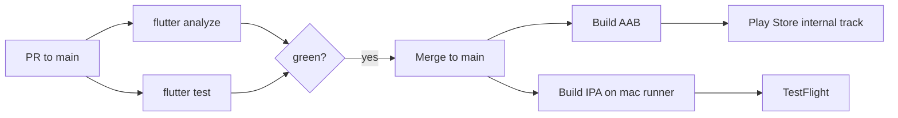

CI secrets required: `RAZORPAY_KEY_ID`, Android keystore + alias, App Store Connect API key.

## 14.5 Deployment Topology

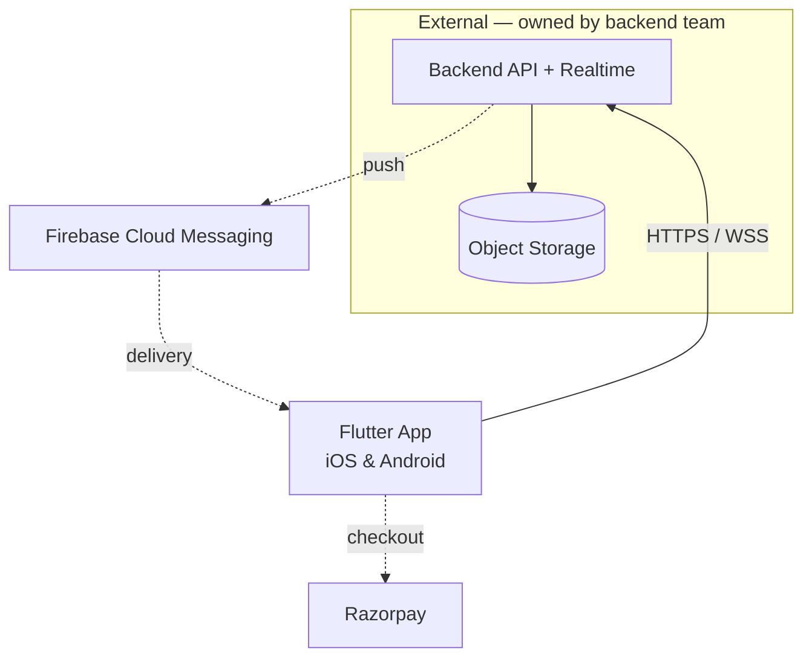

## 14.6 Release Channels

| Channel | Android | iOS |
|---|---|---|
| Internal QA | Play Store internal testing | TestFlight internal |
| Closed Beta | Play Store closed testing | TestFlight external |
| Production | Play Store production | App Store |

---

# 15. Testing Documentation

## 15.1 Test Inventory (current)

| File | Type | Scope |
|---|---|---|
| `test/booking_api_service_test.dart` | Unit | Booking service integration |
| `test/booking_model_test.dart` | Unit | Booking model serialization |
| `test/team_model_test.dart` | Unit | Team model |
| `test/widget_test.dart` | Widget | Smoke widget test |
| `test/check_firebase_config.dart` | Manual harness | Firebase wiring check |

## 15.2 Unit Testing Strategy

- `flutter_test` + Riverpod `ProviderContainer` overrides for isolated provider tests.
- Mock Dio with `mocktail` / `http_mock_adapter` for service-layer tests; do not hit the live backend in unit tests.

## 15.3 Integration Testing Strategy

- `integration_test` package on a device or emulator.
- Use a dedicated staging backend URL (provided by backend team) and a test Razorpay key.

## 15.4 System / E2E Testing Strategy

- Maestro or Patrol for end-to-end flows on real devices/emulators.
- Critical golden paths:
  1. Onboarding → first booking
  2. Host game → joiner sees it → joins
  3. Live scoring → overlay updates in real time
  4. Chat send/receive with both peers online and one offline (FCM)
  5. Wallet recharge end-to-end with Razorpay test key

## 15.5 UAT Strategy

- Closed beta via Play Store Internal Test + TestFlight.
- Scripted UAT pack: 20 scenarios covering each top-level module.
- Acceptance threshold: 0 P0/P1 defects open.

## 15.6 Edge & Failure Cases

| Area | Edge |
|---|---|
| OTP | Late SMS; user enters expired OTP; rate limit |
| Booking | Slot taken between selection and pay; payment timeout |
| Game join | Race when last slot fills (current_players == max_players) |
| Chat | Send while offline; large attachment; banned content |
| Scoring | Scorer disconnects mid-over; duplicate ball event |
| Wallet | Double-credit on Razorpay retry; refund after partial use |
| Reels | Video codec unsupported on Android < 7; huge file |
| Location | Permission denied mid-flow; coordinates outside India |

---

# 16. Monitoring and Logging

> Server-side metrics, dashboards, and log retention are owned by the backend team. This section covers **mobile-side** observability.

## 16.1 Mobile Metrics (recommended)

| Metric | Source |
|---|---|
| Crash-free sessions | **Firebase Crashlytics** or **Sentry** (recommended; not yet wired) |
| ANRs / janky frames | Firebase Performance |
| API error rate from the client's perspective | Custom event on Dio `onError` |
| Cold start time | `Performance` trace around `main()` |
| Screen-load timings | Per-screen trace |
| FCM token registration success | Custom event |
| Razorpay checkout outcome | Custom event (success / failure / dismissed) |

## 16.2 Logging Strategy (Client)

- Use the `logger` package already in `pubspec.yaml`; gate verbose logs behind `kDebugMode`.
- Tag every outbound request with `X-Request-Id` (already generated via `uuid`) so backend logs and client logs can be correlated.
- **Never** log JWTs, OTPs, phone numbers (beyond last-4), or payment IDs.

## 16.3 Alert Thresholds (mobile, recommended)

- Crash-free sessions < 99% in any 24-h window.
- Razorpay checkout success rate < 95% over 100 attempts.
- 4xx rate > 5% of all client requests over 1 h (signals a contract drift with backend).

---

> Only risks the **mobile app owns** are listed. Backend hardening (BOLA, CORS, secrets rotation, Razorpay server verification, migrations, scaling) belongs to the backend team — track separately.

## 17.1 Mobile-Side Technical Risks

| Risk | Likelihood | Impact | Mitigation |
|---|---|---|---|
| API path drift between client and server (mobile uses `/api`; canonical is `/api/v1`) | Medium | Medium | Flip `_productionUrl` in `lib/config/api_config.dart` once backend confirms versioned path |
| Dual token store (SecureStore + SharedPreferences) during transition | Medium | Low | Retire `SharedPreferences` mirror after all services consume `ApiClient` |
| Two parallel networking stacks (legacy `api_service.dart` + new `core/network/api_client.dart`) | Medium | Medium | Complete migration; delete legacy path |
| No crash reporter wired | High | Medium | Add Sentry or Firebase Crashlytics before public launch |
| Single-environment switch via source constant in `ApiConfig` | Medium | Low | Move to `--dart-define=ENV=prod|stage|dev` to mirror Razorpay pattern |

## 17.2 Mobile-Side Security Risks

| Risk | Likelihood | Impact | Status |
|---|---|---|---|
| Razorpay key embedded in source | High | High | **Resolved** — now from `--dart-define=RAZORPAY_KEY_ID`, asserted at boot |
| No certificate pinning | Medium | Medium | Pin `prod-api.kridaz.com` cert; rotate plan documented |
| No release-build obfuscation | Medium | Low | Add `--obfuscate --split-debug-info=...` (documented in §14.3) |
| Contacts / location permissions requested without explicit consent UI | Medium | Medium | Add explainer screens before OS prompt |

## 17.3 Operational Risks (Mobile)

| Risk | Likelihood | Impact | Mitigation |
|---|---|---|---|
| Manual environment switch in `ApiConfig` | Medium | Medium | Build flavors via `--dart-define` |
| Force-update gate relies on backend version endpoint | Low | High | Confirm endpoint contract with backend team and add fallback |
| No automated mobile CI | High | Medium | Add GitHub Actions workflow per §14.4 |
| Apple Sign-In maintenance (App Store 4.8) | Low | High | Annual review of Apple SDK changes; iOS-only gate already in place |

---

# 18. Future Enhancements

## 18.1 Product Roadmap

| Horizon | Feature |
|---|---|
| H1 (0–3 mo) | Server-side RBAC enforcement, Alembic migrations, Razorpay server verification, multi-sport scoring (football, badminton) |
| H2 (3–6 mo) | Public reels with moderation, equipment marketplace re-launch, coach booking end-to-end, leaderboards persisted |
| H3 (6–12 mo) | In-app live streaming, ML matchmaking, tournaments bracketing, web companion |

## 18.2 Technical Improvements

- Migrate to **Clean Architecture** layout already scaffolded under `lib/{data,domain,presentation}/`.
- Adopt **Alembic** for schema migrations.
- Introduce **Redis** for Socket.IO scaling, sessions, rate limiting.
- Move object storage to **S3/R2**, serve via CDN.
- Add **Sentry** (mobile + backend) and **Prometheus + Grafana** dashboards.

## 18.3 Scaling Strategy

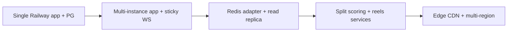

---

# 19. Maintenance Guide

## 19.1 Code Maintenance

- Run `flutter analyze` and `flutter test` on every PR.
- Keep `pubspec.yaml` versions pinned; review for security advisories quarterly.
- Migrate remaining services off the legacy `api_service.dart` onto `core/network/api_client.dart`; delete the legacy path once unused.
- Retire the SharedPreferences token mirror once all services consume `ApiClient` exclusively.

## 19.2 Database Maintenance

- Out of scope for this repository — owned by the backend team.

## 19.3 Infrastructure Maintenance (Mobile-only)

- Rotate Razorpay key id in CI secrets on vendor recommendation.
- Renew Apple Developer + Google Play signing keys per platform policy.
- Refresh `google-services.json` / `GoogleService-Info.plist` if Firebase project changes.
- Monitor Play Store / App Store policy changes (notably Sign-in with Apple 4.8 enforcement).

## 19.4 Versioning Strategy

- **Mobile:** Semantic versioning `MAJOR.MINOR.PATCH+BUILD` in `pubspec.yaml` (`1.0.0+1`). Bump `BUILD` per build; `PATCH` for fixes; `MINOR` for features; `MAJOR` for breaking changes.
- **API:** Path-versioned (`/api/v1`). Introduce `/api/v2` only on breaking changes; keep `v1` for ≥ 6 months.
- **DB:** Each schema change shipped via Alembic migration; never edit existing migrations.

## 19.5 Release Management

- Branching: `main` (prod), feature branches (`Vamshiz`, etc.), no long-lived dev branch.
- Release notes generated from PR titles via `gh release create`.
- Force-update infrastructure (`core/version/version_state.dart` + `force_update_screen.dart`) used to drop support for unsafe client versions.

---

# 20. Appendices

## 20.1 Glossary

| Term | Definition |
|---|---|
| Booking | A reservation of a venue slot by a user |
| Game | A user-hosted match open for others to join |
| Host | The user who created a game |
| Tournament | A multi-match event using `game_type=tournament` |
| Reel | Short-form video post |
| Scorer | Authorized user running live scoring |
| Team Pass | QR-coded entry artifact for a team |
| Whitelisted Creator | Manually approved user permitted to post reels |
| Nearby Player | A user within `search_radius_km` who has `location_sharing_enabled` |

## 20.2 Acronyms

| Acronym | Meaning |
|---|---|
| API | Application Programming Interface |
| BMS | Booking Management System (repo codename) |
| FCM | Firebase Cloud Messaging |
| JWT | JSON Web Token |
| ORM | Object-Relational Mapper |
| OTP | One-Time Password |
| PII | Personally Identifiable Information |
| RBAC | Role-Based Access Control |
| RPO/RTO | Recovery Point / Time Objective |
| SDD | Software Design Document |
| SRS | Software Requirements Specification |
| WS | WebSocket |

## 20.3 References

- Flutter — https://flutter.dev
- Riverpod — https://riverpod.dev
- GoRouter — https://pub.dev/packages/go_router
- FastAPI — https://fastapi.tiangolo.com
- SQLAlchemy — https://www.sqlalchemy.org
- Razorpay Flutter — https://razorpay.com/docs/payments/payment-gateway/flutter-integration/
- IEEE 830 — Software Requirements Specifications
- IEEE 1016 — Software Design Descriptions
- OWASP API Security Top 10 — https://owasp.org/API-Security/

## 20.4 Assumptions (consolidated)

1. The mobile client and backend are versioned together; the force-update gate is the safety valve.
2. Production runs on Railway with managed PostgreSQL and TLS termination at the edge.
3. All endpoints under `/api/v1` will eventually require `Authorization: Bearer <jwt>` after RBAC rollout.
4. Reels remain admin-whitelisted until moderation tooling ships.
5. Razorpay verification (signature check on `payment_id` + `order_id`) will be implemented server-side before live keys are used.
6. Object storage will move from local `buckets/` to S3-compatible storage before public launch.

## 20.5 Technical Notes

- Mobile `ApiConfig.apiUrl` resolves to `/api` (not `/api/v1`). Backend mounts routers under `/api/v1`. The current canonical path in code is `/api/v1`; the bare `/api` alias is a transitional accommodation.
- `ErrorWidget.builder` is overridden in `main.dart` to suppress red-screen leaks of backend stack traces in production.
- `TokenBridge` syncs the legacy `SharedPreferences` token store with the new `flutter_secure_storage` for cold-start; this dual store will be retired once all services consume `ApiClient` exclusively.

---

*End of document.*
