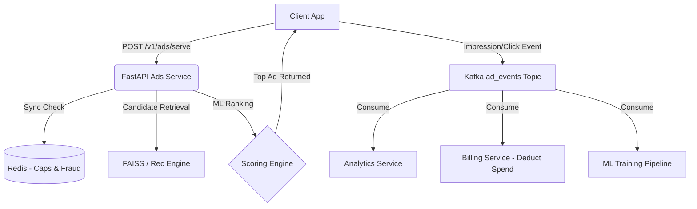

# Industrial-Grade Ads Platform Architecture

Welcome to the Technical Blueprint and Integration Specification for the **Kridaz Ads Platform**. 

This document defines the architectural patterns, latency SLAs, database relationships, moderation flows, and surface integrations for our proprietary programmatic ad network. The system is benchmarked against industry leaders like Meta Ads, Google Ads, and X Ads, built to monetise every surface while rigorously protecting user experience through admin-verified community guidelines.

---

## 1. Executive Summary & Core Philosophy

Kridaz Ads is an industry-grade programmatic advertising system embedded natively into the Kridaz sports social and booking platform. 

### Core Design Goals
1. **Omnipresent Monetisation**: Ads are integrated natively into every high-intent surface, including reels, community feeds, turf search, bookings, and push notifications.
2. **Quality & Safety First**: Every ad must pass an **Admin Verification** process and adhere strictly to community guidelines before going live. Fraud detection runs continuously.
3. **Low-Latency SLA**: Serve ad candidates in `< 80ms` (P99) to ensure they load as fast as organic content.
4. **Vickrey Auction**: Uses a second-price auction where advertisers bid their true maximum, but only pay 1 cent more than the second-highest bid.

---

## 2. Platform Architecture & Data Flow

The platform relies on a distributed architecture to separate high-speed ad serving from asynchronous processing like billing and ML model training.



### Microservices Breakdown
* **`ads-service`** (Python/FastAPI): High-throughput ad serving, tracking, and basic fraud checks.
* **`recommendation-service`** (Python/FAISS): ML-based retrieval (collaborative filtering & vector search).
* **`moderation-service`**: Automated content screening, flagging borderline campaigns for human admin review.
* **`analytics-service`** (Node.js/Redis): Consumes Kafka events for real-time advertiser dashboards.

---

## 3. Ad Surfaces & Placements

To maximize revenue, ads are injected into every available surface organically without disrupting the user flow. Each surface has a specific "Intent Multiplier" applied to the bid value.


| Surface | Ad Format | Intent Weight | Integration Notes |
| :--- | :--- | :--- | :--- |
| **Booking Checkout** | Cross-sell Card | `1.30x (Max)` | Placed right before payment (e.g., related gear or coaching). |
| **Turf Search** | Sponsored Listing | `1.20x` | Highlighted as 'Promoted' within search results. |
| **Turf Detail Page** | Banner + CTA | `1.15x` | Banner below the turf gallery. |
| **Reels Feed** | Video (9:16) | `1.00x` | Inserted every 4-8 organic reels. Max 15 seconds. |
| **Community Feed** | Native Image Card | `0.85x` | Blends with standard posts, marked 'Sponsored'. |
| **Story Placements** | Video / Image | `0.90x` | Full-screen between story transitions. Tap-to-skip. |
| **Post-Booking Success**| Recommendation | `0.70x` | Brand awareness post-transaction. |
| **Push Notifications** | Text + Deep Link | `0.65x` | Opt-in offers. Strictly capped at 1 ad per 24 hours. |
| **Tournaments** | Sponsor Module | `0.95x` | Dedicated banner spots inside live tournament brackets. |

---

## 4. Admin Verification & Moderation Flow

To maintain high platform standards and adhere to Community Guidelines, **NO AD** can go live without automated and manual screening. 

### Moderation Pipeline

1. **Submission**: Advertiser creates a campaign and uploads media/text.
2. **Automated ML Screening (Level 1)**:
   - Media analyzed for NSFW, adult content, violence, or restricted items (alcohol/tobacco/gambling).
   - Text scanned for banned keywords, hate speech, and deceptive financial promises.
   - If severe violation found: **Auto-Rejected**.
3. **Admin Verification (Level 2)**:
   - Campaigns that pass the automated check are placed in a `pending_review` queue.
   - Kridaz Admins review the ad for misleading claims, aesthetic quality, and strict community guideline adherence.
   - **Only Admin Approval sets the status to `active`.**
4. **Post-Live Monitoring (Level 3)**:
   - If users report a live ad > 10 times, the campaign is instantly **Paused** and sent back to the Admin queue for re-evaluation.

> **Caution:** Bypassing the Admin Approval phase for new advertisers is strictly prohibited to ensure compliance with local advertising laws and maintain platform trust.

---

## 5. Ad Ranking & Second-Price Auction

### The Two-Stage ML Pipeline
1. **Retrieval**: Use FAISS to find the top 200 eligible ads based on the user's vector (interests, sports, location) and campaign budget caps.
2. **Multi-Signal Scoring**: Calculate the final eCPM using a weighted formula:

```python
final_score = (0.30 * user_relevance) 
            + (0.20 * sport_exact_match) 
            + (0.15 * location_proximity) 
            + (0.12 * predicted_CTR_ML_model) 
            + (0.10 * bid_amount) 
            + (0.05 * ad_quality_score)

effective_eCPM = bid_amount * predicted_CTR * 1000
```

### The Auction
We utilize a **Second-Price Auction**. 
The winning ad is determined by the highest `effective_eCPM`. However, the advertiser pays only **the minimum amount needed to beat the second-place ad** (plus $0.01 or 1 INR).

*This incentivizes advertisers to bid their true maximum value and rewards high-quality, relevant ads with lower actual costs per click (CPC).*

---

## 6. Database Schema Design

The core data models are optimized for high read throughput and safe transactional billing.

| Table Name | Primary Purpose | Key Fields |
| :--- | :--- | :--- |
| `ad_campaigns` | Campaign settings and budgets | `status`, `daily_budget`, `bid_amount`, `surfaces[]` |
| `ad_targeting` | Rules for whom to show the ad | `target_cities[]`, `target_sports[]`, `geo_radius` |
| `ad_impressions` | Partitioned log of every view | `campaign_id`, `user_id`, `surface`, `shown_at` |
| `ad_clicks` | Tracks clicks and fraud detection | `impression_id`, `is_fraud`, `ip_address` |
| `campaign_daily_spend` | Aggregated metrics for billing | `date`, `spend`, `impressions`, `clicks` |

---

## 7. Fraud Detection

Click fraud drains advertiser budgets and ruins trust. The platform features an aggressive real-time fraud prevention engine.

* **Rate Limiting**: Users clicking > 10 ads per minute, or IPs clicking > 30 times per minute, are flagged in Redis.
* **De-duplication**: If the same user clicks the same ad campaign twice within 30 minutes, the second click is logged but `is_fraud = TRUE` and the advertiser is **not charged**.
* **Anomaly Detection**: Celery tasks scan campaigns every 4 hours. If an ad's Click-Through Rate (CTR) exceeds 50% (bot farm signature), the campaign is paused for admin review.

---

## 8. Client Integration Rules (Frontend)

When integrating the Ads Platform on the Flutter or Web client:

1. **Requesting Ads**: Call `POST /v1/ads/serve` with the user's context, location, and the targeted surface.
2. **Viewport Tracking (CRITICAL)**: Do **not** fire the impression event when the API returns the JSON response. The impression event must **only** be dispatched via Kafka/API when the ad enters the user's physical viewport.
3. **Native Rendering**: Ads must seamlessly match the organic UI of their surrounding surface (e.g., using the exact same fonts and padding as organic community posts), ensuring high engagement.
