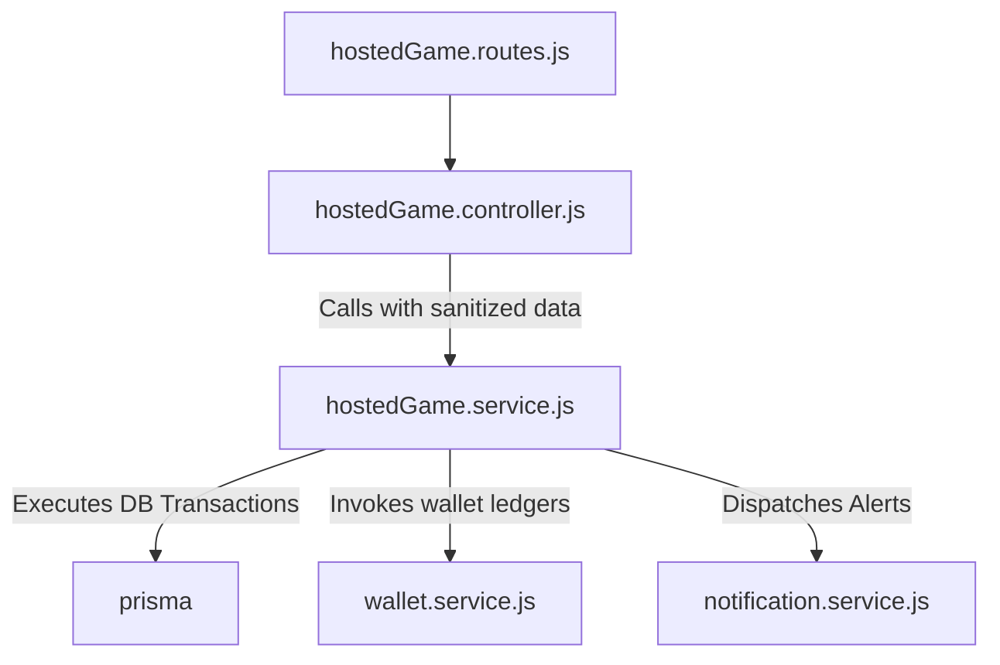

# Kridaz Backend Architectural Audit Report
## Securing the "Gold Standard" Enterprise Architecture

:::note
This audit evaluates the current separation of concerns in the Kridaz Express.js HTTP backend. While the **Booking** and **Scoring** modules have been successfully migrated to the fully decoupled service layer pattern ("Gold Standard"), several legacy controllers still mix HTTP request parsing with low-level database operations (Prisma queries/transactions and Redis commands).
:::

---

## 1. Executive Architecture Score

| Metric | Rating / Value | Description |
| :--- | :--- | :--- |
| **Overall LLD Separation Score** | **78%** | Excellent progress on high-impact transactional domains (Booking, Scoring), but legacy coverage remains. |
| **Gold Standard Adherence** | **2 / 10 Modules** | Booking and Scoring modules are 100% decoupled with dedicated Service layers. |
| **Primary Structural Debt** | **Fat Controllers** | Controllers directly orchestrating Prisma transactions, wallet credits/debits, and third-party API calls. |
| **Target Architecture** | **Service-Oriented** | 100% decoupling: Controllers parse HTTP payloads → Services execute business logic/transactions → Repositories/Prisma handle state. |

---

## 2. Exhaustive Audit Findings

The following table lists the active backend modules that still carry low-level database, Redis, or state orchestration directly inside their controller handlers instead of delegating to a separate Service layer:

| Module / Controller | File Size | Primary Concerns & DB Violations | Complexity Tier | Migration Priority |
| :--- | :--- | :--- | :--- | :--- |
| **`hostedGame.controller.js`** | ~58.7 KB | Orchestrates highly complex matches, user quick slot allocations, multi-party ledger balances, game-official bookings (umpires, scorers), and magic-link invites. | **Tier 1 (Critical)** | **CRITICAL** |
| **`dispute.controller.js`** | ~14.6 KB | Manages support dispute flows, transactional balance freezes/releases across owner and user wallets, and notification scheduling. | **Tier 1 (Critical)** | **HIGH** |
| **`auth.controller.js`** | ~28.2 KB | Manages registration, OTP rate-limiting, and login flows. Mixes Redis commands, JWT signing, and custom DB queries directly in controllers. | **Tier 1 (Critical)** | **HIGH** |
| **`turf.controller.js`** | ~32.4 KB | Handles turf creation, slot configuration generation, and pricing hierarchies. Relational queries directly inside controllers. | **Tier 2 (Medium)** | **MEDIUM** |
| **`team.controller.js`** | ~22.1 KB | Manages team registration, user-team membership mappings, and captain privileges. Relational constraints handled inside HTTP handlers. | **Tier 2 (Medium)** | **MEDIUM** |
| **`chat.controller.js`** | ~8.4 KB | Manages direct messages, channel message queries, and read receipt updates in Prisma. | **Tier 2 (Medium)** | **LOW** |
| **`story.controller.js`** | ~11.2 KB | Simple CRUD for user stories with media attachments, processing callbacks, and auto-expiry logic. | **Tier 3 (Low)** | **LOW** |
| **`blog.controller.js`** | ~6.8 KB | Simple read/write operations for public articles. No complex transactional logic. | **Tier 3 (Low)** | **LOW** |

---

## 3. Tier 1 Migration & Decoupling Blueprints

### Candidate A: The Hosted Game Module (`hostedGame.service.js`)
* **Problem**: `hostedGame.controller.js` has grown into a monolithic 1,750-line file that manages match hosting, player slot operations, umpire assignments, and custom balance ledger holds. This prevents reuse by other channels (e.g. Socket.io commands, automated cron jobs).
* **Proposed Architecture**:



* **Service Signature Spec**:
```javascript
class HostedGameService {
  /**
   * Creates a hosted game, initializes slots, and charges deposit if private.
   */
  async createGame(hostId, payload) { ... }

  /**
   * Joins a game slot, reserves player slot charge from wallet, updates states.
   */
  async joinGameSlot(userId, gameId, slotId) { ... }

  /**
   * Approves join request, transfers fee from escrow, completes slot state.
   */
  async approveJoinRequest(hostId, slotId) { ... }

  /**
   * Rejects join request, releases reserved user wallet balance back to client.
   */
  async rejectJoinRequest(hostId, slotId) { ... }

  /**
   * Cancels match, returns all user reservation balances, updates status.
   */
  async cancelGame(hostId, gameId) { ... }
}
```

---

### Candidate B: The Dispute Module (`dispute.service.js`)
* **Problem**: Dispute processes involve sensitive financial actions (freezing funds from the owner profile `inProgressBalance`, moving to `disputeBalance`, releasing funds on resolution). If any step fails, the system faces balance integrity issues.
* **Proposed Architecture**:
  * Extract all Prisma query transactions from `raiseDispute` and `resolveDispute` into a standalone service.
  * Wrap all balance mutations (`DISPUTE_FREEZE`, `DISPUTE_RELEASE`) in high-isolation database transactions (`prisma.$transaction`).
  
* **Service Signature Spec**:
```javascript
class DisputeService {
  /**
   * Raises a dispute on a booking. Updates status, freezes owner's progressive revenue,
   * writes a Dispute record, and creates a ledger WalletTransaction log.
   */
  async raiseDispute(userId, bookingId, reason, description, images) { ... }

  /**
   * Resolves an open dispute based on administrative decision.
   * Action Types: RELEASE_TO_OWNER, REFUND_TO_USER, PARTIAL_REFUND, CLOSE_NO_ACTION
   */
  async resolveDispute(disputeId, resolutionAction, notes, partialAmount) { ... }
}
```

---

### Candidate C: The Authentication Module (`auth.service.js`)
* **Problem**: Authentication controllers manage user password hashing, JWT creation, verification tokens, and Redis OTP checks directly. Extracting this keeps auth policies highly reusable (e.g. for API gateways or separate microservices).
* **Proposed Architecture**:
  * Decouple password comparison, token issuance, and OTP status validations.
  
* **Service Signature Spec**:
```javascript
class AuthService {
  /**
   * Verifies OTP in Redis. Clears OTP state and returns validation status.
   */
  async verifyOtpToken(phone, token) { ... }

  /**
   * Registers a new user. Performs username membership check using Redis Bloom Filter,
   * hashes password, inserts into Prisma, and generates a session JWT.
   */
  async registerUser(userData) { ... }

  /**
   * Validates credentials and generates access/refresh token pairs.
   */
  async loginUser(phoneOrEmail, password) { ... }
}
```

---

## 4. Path to 100% Service Layer Coverage
To systematically refactor Kridaz to a fully modern, enterprise-grade architecture:

1. **Step 1: Extract Tier 1 Domain Services** (Hosted Game, Dispute, Auth) to guarantee core ledger balances, registrations, and transactions are isolated.
2. **Step 2: Migrate Tier 2 Configuration Services** (Turf, Team, Chat) to standardize visual relations, slot layouts, and communications.
3. **Step 3: Migrate Tier 3 CRUD Services** (Story, Blog) to finish clean separation and achieve 100% controller-to-service routing.
4. **Step 4: Align Socket.io Handlers** directly to the newly created domain services, eliminating redundant HTTP-like controller calls over WebSockets.

:::tip
Keep business logic free of `res.status()`, `req.user`, or any HTTP specifics. Services should accept clean parameters (e.g., `userId`, `payload`) and return raw, structured JavaScript objects or throw standard Errors that the controller's `catch (error)` block safely translates to the client.
:::
