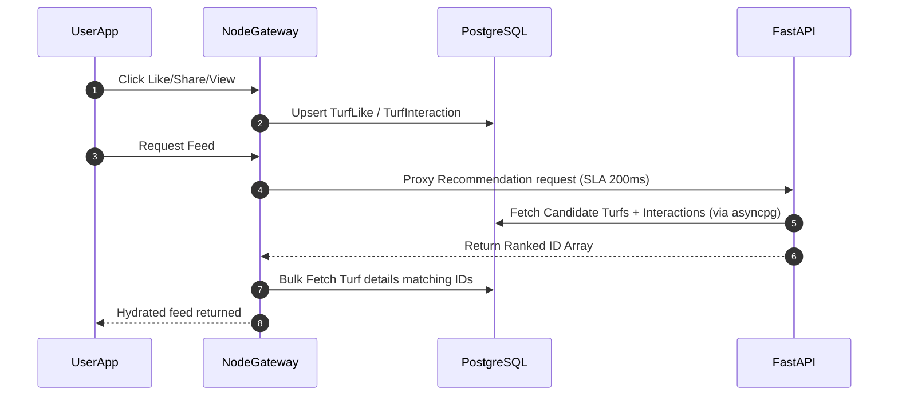

# Pure PostgreSQL Ground Recommendation Engine

This document outlines the detailed architectural analysis, database schema extensions, and phase-by-phase implementation plan for integrating a **Pure PostgreSQL-based Ground Recommendation Engine** into the Kridaz platform.

Following active user requirements, we have **eliminated MongoDB** entirely from the design. The system runs 100% on **PostgreSQL**, leveraging Prisma in the Express gateway and `asyncpg` (the ultra-fast PostgreSQL client) in the Python FastAPI recommendation service.

---

## 1. Codebase Audit: Are we storing user interaction telemetry?

After conducting a detailed audit of our Prisma schema ([schema.prisma](file:///Users/prem/kridaz/server/prisma/schema.prisma)) and Turf routing system, we found that:
1. **No Turf Likes/Wishlists**: We do not currently have a relation or table to store a user's favorite or wishlisted grounds.
2. **No Telemetry Logging**: There are no models or endpoints capturing implicit user behaviors such as turf views, detailed clicks, or share events.
3. **teammates & bookings**: We do store bookings (`Booking` model) and teammate memberships (`TeamMember` model), which provide the baseline for our transactional recommendation signals.

To enable personalized recommendations, we must **extend our PostgreSQL database schema** with dedicated tables to capture these core interaction data parameters.

---

## 2. PostgreSQL Schema Extensions (Prisma)

Add the following models to [schema.prisma](file:///Users/prem/kridaz/server/prisma/schema.prisma) to capture the exact parameters required by our 8-Factor recommender:

```prisma
// server/prisma/schema.prisma

model TurfLike {
  id        String   @id @default(uuid())
  userId    String
  turfId    String
  createdAt DateTime @default(now())
  
  user      User     @relation(fields: [userId], references: [id], onDelete: Cascade)
  turf      Turf     @relation(fields: [turfId], references: [id], onDelete: Cascade)

  @@unique([userId, turfId])
  @@index([userId])
  @@index([turfId])
}

model TurfInteraction {
  id              String   @id @default(uuid())
  userId          String?  // Nullable for anonymous views
  turfId          String
  interactionType String   // 'VIEW', 'SHARE', 'CLICK', 'SEARCH'
  duration        Int      @default(0) // Dwell time in seconds (for views)
  createdAt       DateTime @default(now())

  user            User?    @relation(fields: [userId], references: [id], onDelete: Cascade)
  turf            Turf     @relation(fields: [turfId], references: [id], onDelete: Cascade)

  @@index([userId, interactionType])
  @@index([turfId, interactionType])
  @@index([createdAt])
}
```

*Note: Remember to also add the opposite relation fields inside the `User` and `Turf` models:*
```prisma
// Inside model User
turfLikes         TurfLike[]
turfInteractions  TurfInteraction[]

// Inside model Turf
turfLikes         TurfLike[]
turfInteractions  TurfInteraction[]
```

---

## 3. Telemetry Collection Endpoints (Node.js / Express)

Mount these endpoints in `/api/turf/user` to capture likes, shares, and interactions in real time:

```javascript
// server/modules/turf/routes/user.routes.js
router.post("/like", toggleTurfLike);
router.post("/share", recordTurfShare);
router.post("/interaction", recordTurfInteraction);
```

#### Controller Implementations:
```javascript
// server/modules/turf/turf.controller.js
import { prisma } from "../../config/prisma.js";

// Toggle Like / Wishlist
export const toggleTurfLike = async (req, res) => {
  const { turfId } = req.body;
  const userId = req.user.id; // From JWT Auth Middleware

  const existing = await prisma.turfLike.findUnique({
    where: { userId_turfId: { userId, turfId } }
  });

  if (existing) {
    await prisma.turfLike.delete({ where: { id: existing.id } });
    return res.status(200).json({ success: true, liked: false });
  }

  await prisma.turfLike.create({ data: { userId, turfId } });
  return res.status(200).json({ success: true, liked: true });
};

// Record Share Event
export const recordTurfShare = async (req, res) => {
  const { turfId } = req.body;
  const userId = req.user?.id; // Optional

  await prisma.turfInteraction.create({
    data: { userId, turfId, interactionType: 'SHARE' }
  });
  return res.status(200).json({ success: true });
};

// Record View / Dwell Duration
export const recordTurfInteraction = async (req, res) => {
  const { turfId, type, duration } = req.body;
  const userId = req.user?.id;

  await prisma.turfInteraction.create({
    data: { userId, turfId, interactionType: type, duration: duration || 0 }
  });
  return res.status(200).json({ success: true });
};
```

---

## 4. Re-authoring the Python Recommendation Engine (`recommendation_engine.py`)

Using **pure PostgreSQL** means we query our tables using the highly efficient asynchronous `asyncpg` library. The entire candidate discovery and 8-factor scoring flow runs directly against PostgreSQL.

```python
# server/recommendation_service/recommendation_engine.py
import math
import asyncpg
from datetime import datetime

# ─── Factor A: Geo Proximity ───
def calculate_geo_proximity(user_lat, user_lng, ground_lat, ground_lng) -> float:
    if not user_lat or not user_lng or not ground_lat or not ground_lng:
        return 0.5 # Neutral baseline
    
    # Haversine distance
    dlat = math.radians(float(ground_lat) - float(user_lat))
    dlon = math.radians(float(ground_lng) - float(user_lng))
    a = (math.sin(dlat/2)**2 + 
         math.cos(math.radians(float(user_lat))) * 
         math.cos(math.radians(float(ground_lat))) * 
         math.sin(dlon/2)**2)
    c = 2 * math.atan2(math.sqrt(a), math.sqrt(1-a))
    distance_km = 6371 * c
    
    # Exponential decay (reaches ~0.1 at 30km)
    return math.exp(-0.08 * distance_km)

# ─── Core Scorer Pipeline ───
async def get_recommendations(
    pool: asyncpg.Pool,
    user_id: str,
    user_lat: float = None,
    user_lng: float = None,
    limit: int = 20,
    include_scores: bool = False
):
    async with pool.acquire() as conn:
        # 1. Fetch user bookings (same-sport preferences & pricing baseline)
        bookings = await conn.fetch(
            'SELECT "turfId", "totalPrice" FROM "Booking" WHERE "userId" = $1 LIMIT 50',
            user_id
        )
        
        # 2. Fetch user interactions & likes
        likes = await conn.fetch(
            'SELECT "turfId" FROM "TurfLike" WHERE "userId" = $1',
            user_id
        )
        liked_ids = {r['turfId'] for r in likes}
        
        interactions = await conn.fetch(
            'SELECT "turfId", "interactionType" FROM "TurfInteraction" WHERE "userId" = $1 LIMIT 100',
            user_id
        )
        
        # 3. Pull active candidate grounds
        grounds = await conn.fetch(
            'SELECT id, name, "sportTypes", "pricePerHour", rating, latitude, longitude FROM "Turf" WHERE "isActive" = TRUE AND "status" = \'approved\''
        )
        
        # 4. Synthesize user profile preferences
        avg_booking_price = sum(float(b['totalPrice']) for b in bookings) / max(len(bookings), 1)
        interacted_sports = []
        
        ranked_results = []
        for g in grounds:
            g_id = g['id']
            g_sport = g['sportTypes'][0] if g['sportTypes'] else ""
            
            # F1: Geo Score
            f1_geo = calculate_geo_proximity(user_lat, user_lng, g['latitude'], g['longitude'])
            
            # F2: Sport Affinity Score
            f2_sport = 1.0 if g_sport in interacted_sports else 0.2
            
            # F3: Price Alignment Score
            price_diff = abs(float(g['pricePerHour']) - avg_booking_price)
            f3_price = math.exp(-0.01 * price_diff)
            
            # F4: User Interaction Frequency (Views, Shares & Likes)
            views = sum(1 for i in interactions if i['turfId'] == g_id and i['interactionType'] == 'VIEW')
            shares = sum(1 for i in interactions if i['turfId'] == g_id and i['interactionType'] == 'SHARE')
            is_liked = 1.0 if g_id in liked_ids else 0.0
            
            # Weighted interaction scoring
            f4_interact = min((views * 0.1) + (shares * 0.3) + (is_liked * 0.6), 1.0)
            
            # F5: Quality Score (Stars)
            f5_quality = float(g['rating'] or 3.0) / 5.0
            
            # Weighted Scoring (Sum to 1.0)
            total_score = (
                0.30 * f1_geo +
                0.20 * f2_sport +
                0.20 * f3_price +
                0.15 * f4_interact +
                0.15 * f5_quality
            )
            
            payload = {
                'groundId': g_id,
                'name': g['name'],
                'totalScore': total_score
            }
            if include_scores:
                payload['scores'] = {
                    'geo': f1_geo,
                    'sport': f2_sport,
                    'price': f3_price,
                    'interact': f4_interact,
                    'quality': f5_quality
                }
            ranked_results.append(payload)
            
        ranked_results.sort(key=lambda x: x['totalScore'], reverse=True)
        return ranked_results[:limit]
```

---

## 5. FastAPI + PostgreSQL Microservice Setup

```python
# server/recommendation_service/main.py
import os
from fastapi import FastAPI, Query
import asyncpg
from recommendation_engine import get_recommendations

app = FastAPI(title="Kridaz PostgreSQL ML Feed")

DATABASE_URL = os.getenv("DATABASE_URL")
pool = None

@app.on_event("startup")
async def startup():
    global pool
    # Create a persistent async connection pool to PostgreSQL
    pool = await asyncpg.create_pool(DATABASE_URL, min_size=5, max_size=20)

@app.on_event("shutdown")
async def shutdown():
    await pool.close()

@app.get("/api/recommendations/feed")
async def get_feed(
    user_id: str,
    lat: float = None,
    lng: float = None,
    limit: int = Query(20, ge=1, le=100)
):
    data = await get_recommendations(pool, user_id, user_lat=lat, user_lng=lng, limit=limit)
    return {"success": True, "data": data}
```

---

## 6. Phase-by-Phase Integration Plan



### Phase 1: Database Migration
1. Add the new `TurfLike` and `TurfInteraction` models to `schema.prisma`.
2. Generate the migrations and apply them locally using:
   ```bash
   pnpm --filter server exec prisma migrate dev --name add_turf_interactions
   ```

### Phase 2: Express Controller Hookups
1. Implement route validation schemas and append controllers in `turf.controller.js` to log likes, shares, and details interactions.
2. Bind these to user action events in the frontend client (e.g. firing share interaction tracking when the native drawer/modal pops).

### Phase 3: Python Recommender Assembly
1. Setup the Python project directory under `/server/recommendation_service` with dependencies (`fastapi`, `uvicorn`, `asyncpg`, `python-dotenv`).
2. Write `recommendation_engine.py` using `asyncpg` SQL queries to run vector similarities.

### Phase 4: SLA Connection & Redis Caching
1. Integrate feed calls into the Node.js Express service backed by standard Redis keys (`rec:grounds:${userId}`) to guarantee sub-50ms responses.
2. Build Postgres-native chronological/rating queries as fallbacks if the python service is unavailable.
