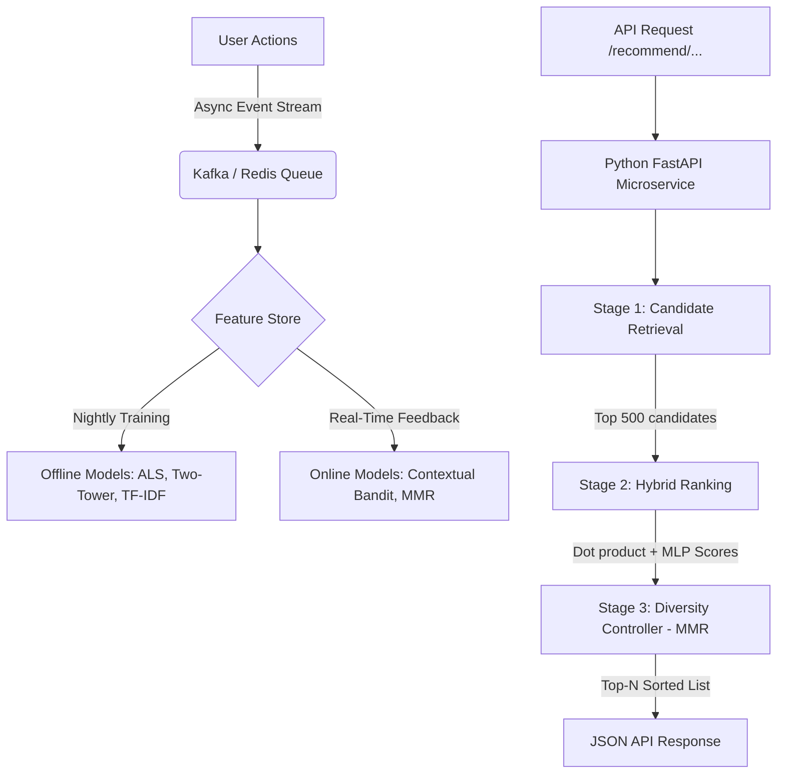
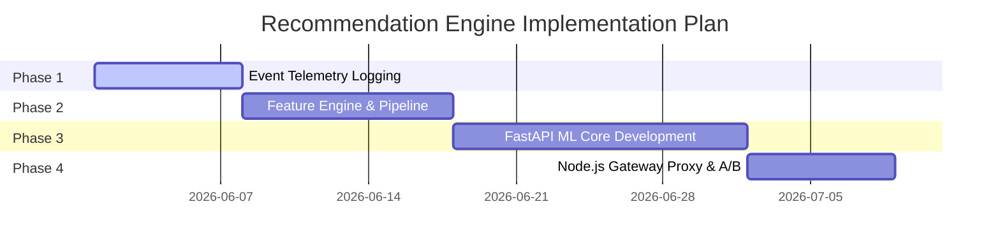

# Recommendation Engine

Welcome to the Technical Blueprint and Integration Specification for the **Kridaz Unified Recommendation Platform**. 

This document defines the architectural patterns, mathematical formulations, database relationships, and phase-by-phase implementation blueprints for integrating a Python-based machine learning recommendation engine alongside our existing Node.js monorepo.

---

## 1. Executive Summary & Core Philosophy

Like Netflix’s 80/20 rule—where 80% of content watched is driven by recommendations rather than direct search—the Kridaz Recommendation Engine is designed to personalises every interactive surface on our platform. 

### Core Design Goals
1. **Drive Engagement**: Target 70%+ of all turf bookings, community post clicks, story plays, and reel views via personalized feeds.
2. **Eliminate Filter Bubbles**: Keep feeds fresh and diverse using hybrid exploration models.
3. **Low-Latency SLA**: Serve recommended candidates in `< 50ms` (caching) or `< 200ms` (live scoring).
4. **Zero-Trust Coupling**: Run as a decoupled, isolated microservice, protecting our main API from memory/CPU spikes.

---

## 2. Recommendation Architecture & Mathematics

The recommendation platform does not use a single "catch-all" algorithm. It consists of **4 specialized engines** processing raw events through a standard two-stage **Retrieval & Ranking** pipeline.



### Stage 1: Candidate Retrieval (The Funnel)
Filters millions of raw items down to **Top 500 candidates** in under 20ms using high-performance vector retrieval:
* **Two-Tower Neural Network**: Learns deep 128-dimensional representations of User and Item features.
  `Score = UserTower(UserFeatures) · ItemTower(ItemFeatures)`
* **ALS Collaborative Filtering (implicit feedback)**: Deconstructs user-item interaction histories to discover hidden affinity patterns.
* **Vector Search**: Item vectors are pre-computed nightly and queried live via a **FAISS** (Facebook AI Similarity Search) index.

### Stage 2: Heavy Ranking (Multi-Gate scoring)
Scores the 500 candidates using a **LightGBM Ranker / XGBoost** model that evaluates a weighted combination of signals:

| Signal | Starting Weight | Primary Purpose |
| :--- | :--- | :--- |
| **Collaborative Filtering** | `0.25` | Finds "Users similar to you also booked/liked..." |
| **Two-Tower Neural Score** | `0.20` | Captures deep non-linear semantic interactions. |
| **Content-Based (TF-IDF)** | `0.15` | Matches explicit tags (location, sports types, rating). |
| **Social Graph (PPR)** | `0.10` | Measures network proximity (friends of friends). |
| **Recency / Freshness** | `0.08` | Hacker News-style time decay prevents stagnant feeds. |
| **Global Popularity** | `0.07` | Fallback gate for global/local trends. |
| **Contextual Bandit (LinUCB)** | `0.05` | Allocates exploration weight for cold discovery. |
| **Quality Ratings** | `0.05` | Gatekeepers to ensure poor items (ratings < 3.0) are penalised. |
| **Distance Proximity** | `0.03` | Geolocation penalty for physical matches (grounds/players). |
| **Price Match Alignment** | `0.02` | Normalizes recommendations to user's typical price bracket. |

### Stage 3: Diversity & Fairness Controller
To prevent user feeds from getting saturated with a single type of sport (e.g., seeing only Cricket turfs), we pass the scored list through **Maximal Marginal Relevance (MMR)**:

```text
MMR(item) = (1 - lambda) * Relevance(item) - lambda * MaxSimilarity(item, already_selected_items)
```

* **lambda = 0.25** by default (balances relevance with novelty).
* **Sport Diversity Cap**: Enforces a strict cap where no single sport can occupy more than 3 slots in the first 20 recommended feed entries.

---

## 3. Surface-Specific Implementation Details

We customize the signal inputs and ranking configurations across Kridaz's core vectors:

### A. Reels Recommendation Engine (`ReelPostFeedRecommender`)
* **Core Signals**: Watch time (dwell), completion rates, likes, comments, shares, skips.
* **Strategy**: Real-time Contextual Bandit (LinUCB). Dwell time scales rewards logarithmically: `DwellWeight = 2.0 + 0.01 * min(seconds, 120)`
* **Explore Slots**: Every 5th position in the Reels feed is reserved for exploration (`EXPLORE_SLOT_INTERVAL = 5`) to test user interest in new creators or alternative sports.

### B. Community Post Suggestions
* **Core Signals**: Follow graph, freshness, trending hashtags, user category interest, post engagement.
* **Strategy**: LightGBM Ranker combined with a Hacker News-style time decay formula: `HNScore = (upvotes + comments * 2) / (age_hours + 2)^1.8`
* **Bootstrap**: New community posts receive a fading freshness multiplier for the first 72 hours (+0.30 boost on Day 1, +0.15 on Day 2).

### C. Story Discovery
* **Core Signals**: Follow status, mutual relationships, viewer history.
* **Strategy**: Social Graph PageRank. Stories must be actively filtered out as soon as the user views them (Prisma `StoryViewers` relation checks) or when they cross their explicit expiration limit (`expiresAt`).

### D. Turf & Ground Recommendations (`GroundRecommender`)
* **Core Signals**: User bookings history, geographical coordinates (lat/long), booking hours, amenities.
* **Strategy**: Collaborative Filtering + Geo Search. Uses haversine distance penalties to decay turf scores if they are too far from the user's primary location.

### E. Player & Umpire/Coach Suggestions
* **Core Signals**: Same sports types, location overlap, direct interactions, mutual followers.
* **Strategy**: **Personalized PageRank (PPR)** run over the social graph database to calculate closeness metrics between users.

---

## 4. Architectural Technology Stack

### Why Python FastAPI is the Best Fit
While Node.js is excellent at concurrent I/O, transactional APIs, and web sockets, it lacks the memory-safe mathematical operations and rich libraries required for machine learning. 
We leverage **FastAPI** for our ML recommendation service to run native C++ bindings for ML pipelines:

* **FastAPI**: Blazing-fast web framework with asynchronous runtime, built-in Swagger/OpenAPI docs, and excellent performance.
* **Implicit (ALS)**: Extremely fast C++ implementation of Alternating Least Squares with GPU acceleration options.
* **scikit-learn**: Vectorizes content tags using `TfidfVectorizer` and processes cosine similarity.
* **LightGBM / XGBoost**: High-efficiency decision tree library optimized for ranking tasks (`lambdarank`).
* **FAISS (Facebook AI Similarity Search)**: C++ native vector database that searches high-dimensional space in sub-millisecond speeds.
* **NetworkX / Neo4j**: Constructs follows/bookings graphs to calculate PageRank closeness scores.
* **Redis**: Acts as the shared data plane for caching model vectors (TTL 10m) and tracking bandit feedback state.
* **Celery + Redis**: Schedules nightly batch retraining tasks at 3 AM (low traffic hours).

---

## 5. Node.js Codebase Analysis & Integration Points

The integration will utilize a **non-intrusive proxy model** using `axios` or `undici` to communicate with the python FastAPI server. 

```
                                              ┌─────────────────────────────────┐
                                              │      kridaz-rec-engine          │
                                              │       (FastAPI - Python)        │
                                              │                                 │
                                              │  ┌───────────────────────────┐  │
                                              │  │ /recommend/feed/{userId}  │  │
                                              │  └───────────────────────────┘  │
                                              └──────────────▲──────────────────┘
                                                             │ 
                                                             │ HTTP /recommend (timeout: 200ms)
                                                             │ 
┌────────────────────────────────────────────────────────────┼──────────────────┐
│ server/                                                    │                  │
│                                                            │                  │
│   ┌─────────────────────────────────┐           ┌──────────┴───────────────┐  │
│   │   reels.controller.js           │           │  recommendations.service │  │
│   │   (Get Feed API)                │──────────▶│  (Handles proxying &    │  │
│   │                                 │           │   Redis fallbacks)       │  │
│   └─────────────────────────────────┘           └──────────────────────────┘  │
│                                                                               │
│   ┌─────────────────────────────────┐                                         │
│   │   app.js                        │                                         │
│   │   (Mounts routers)              │                                         │
│   └─────────────────────────────────┘                                         │
└───────────────────────────────────────────────────────────────────────────────┘
```

Here are the precise integration files inside our monorepo:

### 1. `server/modules/reels/reels.controller.js`
* **Current Status**: Lines 129–239 (`getReelsFeed`) and Lines 408–452 (`getRecommendedReels`) fetch reels from the database ordered chronologically by ID and cached globally for 5 minutes.
* **Integration Plan**:
  ```javascript
  // Inside server/modules/reels/reels.controller.js
  import * as recService from '../recommendations/recommendations.service.js';

  export const getReelsFeed = async (req, res) => {
    try {
      const userId = req.user?.id;
      const { cursor, limit = 10 } = req.query;

      let recommendedIds = [];
      if (userId) {
        // Fetch personalized candidate IDs from the python microservice
        recommendedIds = await recService.getReelRecommendations(userId, limit);
      }

      const where = { status: 'ready', isPrivate: false };
      
      let reels;
      if (recommendedIds && recommendedIds.length > 0) {
        // Query items using the ordered list of IDs returned by the ML model
        reels = await prisma.$queryRaw`
          SELECT * FROM "Reel" 
          WHERE id = ANY(${recommendedIds}) 
          ORDER BY array_position(${recommendedIds}, id)
        `;
      } else {
        // Fallback to traditional chronological query if service fails/times out
        reels = await prisma.reel.findMany({
          where,
          orderBy: { id: 'desc' },
          take: limit
        });
      }
      
      // Formatting and returning client response...
    } catch (error) { ... }
  };
  ```

### 2. `server/modules/reels/reels.controller.js` (Telemetry Hooks)
* **Current Status**: Lines 244–295 (`interactWithReel`) and Lines 371–406 (`trackWatchTime`) process interactions (likes, shares, views) and saves them to PostgreSQL via Prisma.
* **Integration Plan**: Add an asynchronous hook that forwards telemetry data directly to the Python FastAPI microservice `/feedback` endpoint:
  ```javascript
  // After saving interaction to Prisma
  recService.recordFeedback(userId, reelId, 'reel', type).catch(err => {
    logger.warn('[REC_ENGINE] Failed to capture interaction event:', err.message);
  });
  ```

### 3. `server/modules/community/community.controller.js`
* **Current Status**: Line 177 (`getPosts`) queries community posts, supporting generic cursors.
* **Integration Plan**: Query `/recommend/posts/{userId}` from FastAPI. Fallback to basic chronological or popularity scores if FastAPI is unreachable.

### 4. `server/modules/player/player.controller.js`
* **Current Status**: Line 22 (`getPublicPlayers`) and Line 459 (`getNearbyPlayers`) fetch active player profiles using simple filters.
* **Integration Plan**: Proxy requests to `/recommend/players/{userId}`, providing location parameters (`latitude`, `longitude`) and personal sport interests (`sportTypes`), then merge with proximity vectors.

---

## 6. Schema Mappings & Data Plan

Our database schema (`server/prisma/schema.prisma`) is perfectly positioned to serve as the feed plane. Below is the mapping of our Prisma models to the recommendation features:

| Prisma Model | ML Feature Store Column | Signal Category |
| :--- | :--- | :--- |
| **`User`** / **`UserProfile`** | `userId`, `sportTypes`, `interests`, `city`, `latitude`, `longitude` | **User Preference Vector** |
| **`Turf`** | `turfId`, `sportTypes`, `groundTypes`, `facilities`, `pricePerHour`, `rating` | **Item Attribute Vector (Discovery)** |
| **`Booking`** | `userId`, `turfId`, `status`, `playStartTime`, `totalPrice` | **Explicit Purchase Intent (ALS)** |
| **`Reel`** | `reelId`, `creatorId`, `hashtags`, `views`, `likes`, `comments`, `duration` | **Item Attribute Vector (Reels)** |
| **`ReelInteraction`** | `userId`, `reelId`, `type` (like/view/share), `watchTime`, `completionRate` | **Implicit Engagement Reward (LinUCB)** |
| **`Post`** | `postId`, `creatorId`, `hashtags`, `createdAt` | **Item Attribute Vector (Posts)** |
| **`UserRelationship`** | `userId`, `followingId` | **Graph Relationships (PPR)** |

---

## 7. A/B Testing & Production Metrics

To validate model updates, we will deploy a simple hash-bucket A/B testing mechanism inside the Node.js API layer.

### Bucket Determination
```javascript
import crypto from 'crypto';

export function getExperimentBucket(userId, numBuckets = 100) {
  const hash = crypto.createHash('md5').update(userId).digest('hex');
  return parseInt(hash.substring(0, 8), 16) % numBuckets;
}
```

* **Control Group (Buckets 0-49)**: Uses default heuristics (Content-based heavy, low CF weight).
* **Treatment Group (Buckets 50-99)**: Blends in the deep Two-Tower Neural Embeddings + FAISS vector lookup.

### North Star Target Metrics
* **Click-Through Rate (CTR)**: Target **> 8.0%** (Currently around 3-4% using static feed listings).
* **Ground Booking Rate**: Target **> 3.0%** of recommended views translating to payment/booking.
* **NDCG@10 (Normalized Discounted Cumulative Gain)**: Target **> 0.65** (Measures ranking quality).
* **Serendipity Index**: Target **> 10.0%** (Percentage of recommended and liked items that user has never interacted with before).

---

## 8. Development & Implementation Roadmap

We split the implementation into 4 sequential phases:



### Phase 1: Event Tracking & Telemetry (Telemetry Phase)
* **Goal**: Capture user engagement behavior in a standard form.
* **Tasks**:
  1. Add an async backend event queue to process telemetry logs without blocking active request threads.
  2. Implement comprehensive analytics hooks in `interactWithReel`, `trackWatchTime`, `likePost`, and `confirmBooking`.
  3. Ensure events contain standard payload fields: `userId`, `itemId`, `itemType`, `eventType` (click, dwell, like, share, book), and `timestamp`.

### Phase 2: Feature Store & Data Pipelines (Data Phase)
* **Goal**: Build unified pipelines that clean and format Postgres data for ML model consumption.
* **Tasks**:
  1. Build automated extract scripts that pull `UserProfile`, `Turf`, `Reel`, and interaction tables.
  2. Transform tabular data into dense interaction matrices.
  3. Load user preference arrays (e.g. `sportTypes` interest) into a Redis fast-access caching tier.

### Phase 3: Python ML Core (FastAPI Engine Phase)
* **Goal**: Code the FastAPI service holding the intelligence layer.
* **Tasks**:
  1. Initialize the FastAPI repository under `server/recommendation_service`.
  2. Code the **Stage 1 (Retrieval)** layer using Implicit (ALS) collaborative filtering and precalculated FAISS vector indices.
  3. Code the **Stage 2 (Ranking)** scoring engines with standard XGBoost/LightGBM ensembles.
  4. Build the **LinUCB Contextual Bandit** exploration engine for real-time feed exploration.
  5. Apply the **Maximal Marginal Relevance (MMR)** diversity controller.

### Phase 4: Gateway Proxy & Caching (Node.js Integration Phase)
* **Goal**: Connect the microservice live, verify fallback layers, and launch A/B testing.
* **Tasks**:
  1. Create `server/modules/recommendations/recommendations.service.js` containing API client proxy rules (200ms timeout SLA).
  2. Implement Redis caching layers (TTL 10m) to serve cached results, reducing load on FastAPI.
  3. Build fallback queries inside Postgres using raw SQL to gracefully fail open if FastAPI is down.
  4. Write the MD5 hash bucket splitter to enable safe A/B testing.
  5. Document deployment specifications inside `render.yaml` using Python base runtimes.
