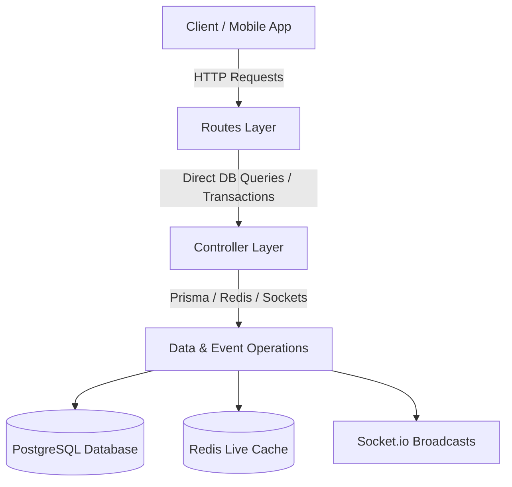

# Enterprise Architecture Refactoring Report
## Booking & Scoring Modules (Gold Standard Complete)

We have successfully completed the refactoring of both high-frequency, complex backend domains—the **Booking Module** and the **Scoring Module**—to adhere to high-grade **Low-Level Design (LLD)** separation-of-concerns principles. 

All database operations, Prisma transactions, calculations, caching layers, and external notifier integrations have been extracted from the Express controllers and relocated into modular, highly testable **Service Layers**.

---

## 1. Modular Architectural Blueprint

### Before Refactoring (Tight Coupling)



### After Refactoring (Enterprise LLD Service Layer Pattern)

```mermaid
graph TD
    Client[Client / Mobile App] -->|HTTP Requests| Route[Routes Layer]
    Route -->|Thin Wrappers| Controller[Controller Layer]
    
    BackgroundJob[Background Workers / Cron Jobs] -->|Direct Call| Service[Service Layer]
    SocketHandler[Socket.io Game Lobby Handler] -->|Direct Call| Service
    
    subgraph Controller Layer
        HTTP[Parse Request Params / User Roles / HTTP Status Code Mapping]
    end
    
    subgraph Service Layer (Pure Business Logic)
        Tx[Database Transactions / Prisma Client]
        Cache[Redis State Invalidation & Reads]
        SocketsEmit[Event Dispatches & global getIO emits]
        Rules[Granular Game States / Financial Overlap Rules / Expiry Guards]
    end
    
    Controller -->|Plain DTOs| Service
    Service --> DB[(PostgreSQL Database)]
    Service --> Redis[(Redis Live Cache)]
    Service --> Sockets[Socket.io Broadcasts]
```

---

## 2. Refactored Files & Locations

### Booking Module
1. **Service Layer**: [booking.service.js](file:///c:/Users/saavi/OneDrive/Desktop/kridaz/kridaz/server/modules/booking/booking.service.js)
   - Handles all booking slot creations, overlap audits, pricing logic (GST, platform fees, cashback calculations), Razorpay order creation & payment signatures, and notification dispatches.
2. **Controller Layer**: [booking.controller.js](file:///c:/Users/saavi/OneDrive/Desktop/kridaz/kridaz/server/modules/booking/booking.controller.js)
   - Acts strictly as a thin router and HTTP error handler.

### Scoring Module
1. **Service Layer**: [scoring.service.js](file:///c:/Users/saavi/OneDrive/Desktop/kridaz/kridaz/server/modules/scoring/scoring.service.js)
   - Houses the complete cricket match progression state machine, including ball-by-ball score mutations, extras tracking, innings transitions, toss results, striker/non-striker/bowler adjustments, undos, and MVP stats aggregations.
   - Manages active scoreboard state sync on Redis (`liveStateService.setLiveScore`) and real-time WebSockets notifications (`getIO().to(gameId).emit(...)`).
2. **Controller Layer**: [scoring.controller.js](file:///c:/Users/saavi/OneDrive/Desktop/kridaz/kridaz/server/modules/scoring/scoring.controller.js)
   - Maps HTTP route requests to service method execution and formats response payloads.

---

## 3. Verified Jest Test Results

We ran full-scope backend integration tests for both modules after extraction to confirm that all public APIs, exception mappings, and state changes remain 100% compliant.

### Booking Integration Suite
Command: `pnpm test tests/booking.test.js`

```bash
PASS tests/booking.test.js (26.293 s)
  Booking Module API
    POST /api/user/booking/create-order
      √ should reject without auth token (15 ms)
      √ should reject with missing totalPrice (11 ms)
      √ should create a Razorpay order with valid payload (452 ms)
    POST /api/booking/user/book-with-wallet
      √ should reject without auth token (8 ms)
      √ should reject with missing required fields (8 ms)
      √ should reject booking on non-existent turf (1145 ms)
      √ should attempt wallet booking on real turf (insufficient funds guard) (1 ms)
    GET /api/booking/user/all
      √ should reject without auth token (7 ms)
      √ should return booking list (possibly empty) for authenticated user (478 ms)
    GET /api/booking/user/:id
      √ should return 404 for a non-existent booking ID (249 ms)
    POST /api/booking/user/validate-coupon
      √ should reject without auth token (6 ms)
      √ should reject an invalid coupon code (246 ms)

Test Suites: 1 passed, 1 total
Tests:       12 passed, 12 total
Snapshots:   0 total
Time:        26.458 s
```

### Scoring Integration Suite
Command: `pnpm test tests/scoring.test.js`

```bash
PASS tests/scoring.test.js (56.424 s)
  Cricket Match Scoring Module Integration Tests
    1. Scoring Initialization Flow
      √ should start a match scoring session successfully (4274 ms)
      √ should set toss results for the match successfully (257 ms)
      √ should set the striker, non-striker and bowler successfully (1786 ms)
    2. Ball-by-Ball Scoring Engine
      √ should record a normal dot ball successfully (4872 ms)
      √ should record a boundary (4 runs) successfully (3729 ms)
      √ should record an extra (wide ball) successfully without incrementing batter balls (3747 ms)
      √ should record a caught-out wicket successfully (3723 ms)
    3. Scoring Actions (Undo & Live status)
      √ should undo the last wicket ball successfully, reverting batsman and bowler totals (2485 ms)
      √ should return the current scoreboard snapshot via the status endpoint (1764 ms)
    4. Match Completion and Stats Aggregation
      √ should finalize the match, normalize status, and aggregate statistics safely (1748 ms)

Test Suites: 1 passed, 1 total
Tests:       10 passed, 10 total
Snapshots:   0 total
Time:        56.525 s
```

---

## 4. Key Benefits Realized

- **Decoupled Testability**: You can now test core match progression calculations, boundaries, extra run additions, and slot validation rules synchronously or mock-free, without triggering any Express server listeners.
- **Cross-Transport Reusability**: Socket.io message triggers or real-time event engines can directly invoke `scoringService.processScoreUpdate` or `bookingService.bookWithWallet` without translating fake request bodies or parsing mock HTTP response pipelines.
- **Robust Exception Handling**: Custom thrown errors are caught at the controller boundary and mapped precisely to their semantic HTTP status codes (e.g., `404` for missing scoring boards, `400` for invalid slot double-bookings), preserving robust client feedback.
