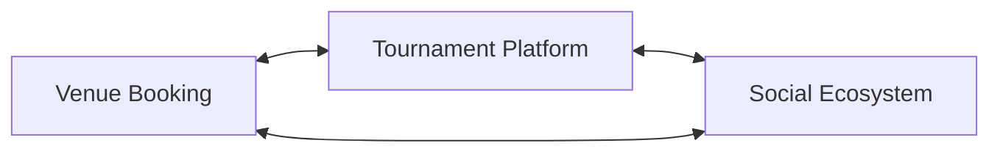
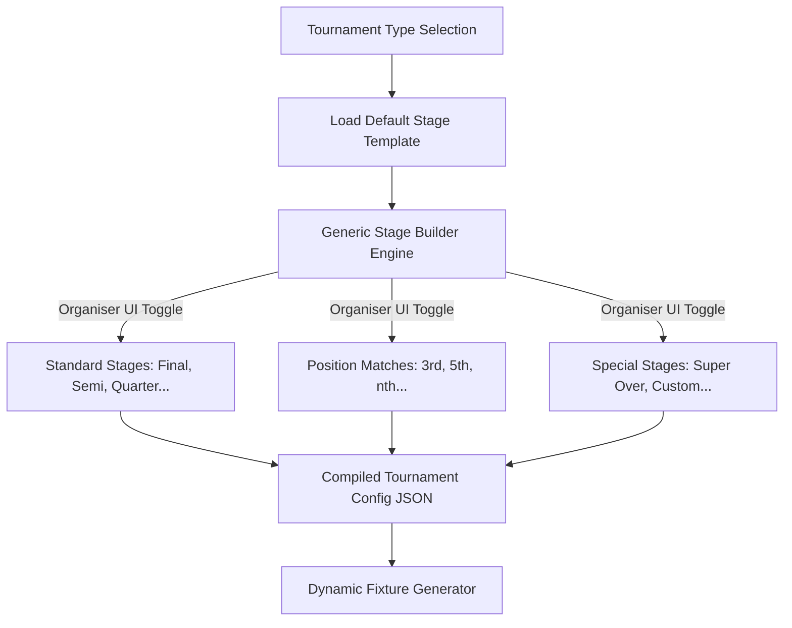

# Reusable Tournament Stage Builder Architecture

This document outlines the product vision, database schemas, JSON configurations, and frontend UI specs for the **Kridaz Unified Tournament Platform**. 

By building a generic, state-driven stage builder rather than hardcoding stage logic to specific formats (like Knockout or League), Kridaz transitions from a simple venue-booking tool into a comprehensive tournament ecosystem that outperforms established platforms like CricHeroes, Hudle, and Playo.

---

## 1. Product Vision: Beyond Venue Booking

To beat platforms like CricHeroes, Kridaz must integrate tournament orchestration directly into our social sports network. 



By allowing organizers to construct custom tournament formats step-by-step, we build a platform that fits local corporate matches, weekend cups, box cricket tournaments, and college leagues natively.

---

## 2. Decoupled Architecture Philosophy

Traditional platforms hardcode their stage logic (e.g., selecting a "Knockout" tournament restricts the user to standard single-elimination brackets). 

**Kridaz uses a Decoupled Stage Engine.** 
The tournament type (e.g., Round Robin, League, Box Cricket) determines the **default recommendations** for stages, but does not lock down the architecture. Any tournament format can toggle and enable *any* stage configuration (group stages, position playoffs, qualifiers, custom stages, or super overs).



---

## 3. Tournament Creation Flow (Cricket Example)

When an organizer creates a tournament, they proceed through 5 steps:

```markdown
[1. Basic Details] ➔ [2. Match Conditions] ➔ [3. Stage Builder] ➔ [4. Qualification Rules] ➔ [5. Fixtures]
```

### Step 3: Expandable Checklist UI (Stage Builder)
Instead of overwhelming the user with massive dropdowns, the UI displays an **Expandable Checklist** representing the stages.

#### Mockup: Tournament Type - Knockout
Organizers can choose which stages are required, which automatically generates the corresponding fixtures.

```text
Configure Tournament Stages
[+] Standard Stages
    ☑ Quarter Final
    ☑ Semi Final
    ☑ Final
[+] Position Matches
    ☑ 3rd Position Match (Playoff for Semi-Final losers)
    ☑ 5th Position Match (Playoff for Quarter-Final losers)
    ☐ 7th Position Match
    ☑ nth Position Match -> [ Input: 9th ]
[+] Special Stages
    ☑ Super Over (Decider for tied matches)
    ☐ Custom Stage
```

---

## 4. Backend Engine Schema Design

To support a generic stage builder, the configuration must be stored in a flexible JSON format.

### The Configuration Payload
The database stores this configuration in the `Tournament` table inside a single JSONB column, `stageConfig`.

```json
{
  "sport": "cricket",
  "tournamentType": "knockout",
  "teamCount": 16,
  "stageConfig": {
    "stages": [
      {
        "id": "quarter_final",
        "name": "Quarter Finals",
        "type": "KNOCKOUT",
        "sequence": 1,
        "isFinal": false,
        "matchCount": 4
      },
      {
        "id": "semi_final",
        "name": "Semi Finals",
        "type": "KNOCKOUT",
        "sequence": 2,
        "isFinal": false,
        "matchCount": 2
      },
      {
        "id": "final",
        "name": "The Final",
        "type": "KNOCKOUT",
        "sequence": 3,
        "isFinal": true,
        "matchCount": 1
      }
    ],
    "playoffs": {
      "thirdPosition": true,
      "fifthPosition": true,
      "customPositions": [9]
    },
    "rules": {
      "superOver": true,
      "allowTies": false
    }
  }
}
```

### Prisma Model Extension

Add the following structures to `server/prisma/schema.prisma` to persist this config:

```prisma
model Tournament {
  id              String         @id @default(uuid())
  name            String
  sport           String         // e.g., "cricket"
  mode            TournamentMode // MATCH | TOURNAMENT
  type            String         // "knockout", "round_robin", "custom", etc.
  teamCount       Int
  
  // Decoupled Configuration Payload
  stageConfig     Json           // Stores the StageConfig JSON structure
  
  // Relations
  matches         Match[]
  teams           TournamentTeam[]
  createdAt       DateTime       @default(now())
  updatedAt       DateTime       @updatedAt
}

enum TournamentMode {
  MATCH
  TOURNAMENT
}
```

---

## 5. Dynamic Fixture Generation API

The fixture generator consumes the `stageConfig` block and instantiates the `Match` records.

### Endpoint: `/api/tournament/generate-fixtures`
* **Method**: `POST`
* **Payload**:
```json
{
  "tournamentId": "tournament-uuid-123"
}
```

### Node.js/Prisma Implementation Snippet
Below is a conceptual snippet showing how the backend schedules the dynamic stages:

```javascript
import { PrismaClient } from '@prisma/client';
const prisma = new PrismaClient();

export const generateTournamentFixtures = async (req, res) => {
  const { tournamentId } = req.body;
  
  try {
    const tournament = await prisma.tournament.findUnique({
      where: { id: tournamentId }
    });

    const { stages, playoffs, rules } = tournament.stageConfig;
    let scheduledMatches = [];

    // 1. Process main stages in sequence order
    for (const stage of stages.sort((a, b) => a.sequence - b.sequence)) {
      for (let i = 0; i < stage.matchCount; i++) {
        scheduledMatches.push({
          tournamentId,
          stageId: stage.id,
          stageName: stage.name,
          matchName: `${stage.name} - Match ${i + 1}`,
          status: 'SCHEDULED'
        });
      }
    }

    // 2. Inject Playoff Matches
    if (playoffs.thirdPosition) {
      scheduledMatches.push({
        tournamentId,
        stageId: 'third_position_playoff',
        stageName: '3rd Place Playoff',
        matchName: '3rd Place Match (Loser SF1 vs Loser SF2)',
        status: 'PENDING_QUALIFIERS'
      });
    }
    
    if (playoffs.fifthPosition) {
      for (let i = 0; i < 2; i++) {
        scheduledMatches.push({
          tournamentId,
          stageId: 'fifth_position_playoff',
          stageName: '5th Place Playoff',
          matchName: `5th Place Match - Tie ${i + 1}`,
          status: 'PENDING_QUALIFIERS'
        });
      }
    }

    // Write generated matches to DB
    const createdMatches = await prisma.match.createMany({
      data: scheduledMatches
    });

    return res.status(201).json({
      success: true,
      message: `${scheduledMatches.length} matches created successfully.`,
      data: createdMatches
    });

  } catch (error) {
    return res.status(500).json({ success: false, error: error.message });
  }
};
```

---

## 6. How We Beat CricHeroes (Feature Comparison Matrix)

| Feature | CricHeroes | Kridaz | Why It Wins |
| :--- | :--- | :--- | :--- |
| **Stage Customization** | Hardcoded based on selection (e.g., standard Knockout). | Fully modular. Organize "Knockout" and add a 5th place playoff if teams want extra play-time. | Keeps local teams playing more matches (higher engagement). |
| **Corporate/Weekend Events** | No specific optimizations for corporate-style weekend brackets. | Pre-configured stage presets tailored for fast-paced corporate leagues. | Attracts high-value corporate sponsorships and event planners. |
| **Super Over Integration** | Manual settings required. | Pre-defined rule option inside stage builder. Automatically triggers a tie-breaker. | Smooth match scoring without admin intervention. |
| **Custom Match Progression** | Fixed brackets. | Dynamic drag-and-drop hierarchy adjustment. | Handles unexpected team dropouts gracefully without breaking the tournament. |
