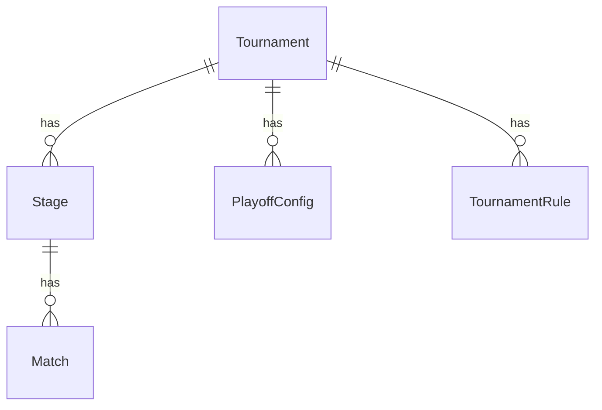

# Tournament Platform Core Architecture

This document describes the core architecture of the **Kridaz Unified Tournament Platform**. 

Rather than hardcoding tournament brackets or relying on unstructured JSON document fields, Kridaz uses a fully relational, decoupled stage database schema in PostgreSQL. This allows organizers to assemble custom tournament progression paths while keeping data structured, normalized, and performant.

---

## 1. Relational Database Schema Design (PostgreSQL)

To support a generic, reusable stage builder in PostgreSQL without using JSON/JSONB schemas (avoiding document-based patterns), we normalize the system into four primary tables: `Tournament`, `Stage`, `PlayoffConfig`, and `TournamentRule`.



### Prisma Schema Definition

This normalized structure ensures full relational integrity, foreign key constraints, and indexing capabilities.

```prisma
model Tournament {
  id              String           @id @default(uuid())
  name            String
  sport           String           // e.g., "cricket"
  mode            TournamentMode   // MATCH | TOURNAMENT
  type            String           // e.g., "knockout", "round_robin", "custom"
  teamCount       Int
  createdAt       DateTime         @default(now())
  updatedAt       DateTime         @updatedAt

  // Relations
  stages          Stage[]
  playoffs        PlayoffConfig[]
  rules           TournamentRule[]
  matches         Match[]
  teams           TournamentTeam[]
}

model Stage {
  id              String         @id @default(uuid())
  tournamentId    String
  name            String         // e.g., "Quarter Finals", "Group Stage"
  type            StageType      // KNOCKOUT | ROUND_ROBIN | LEAGUE
  sequence        Int            // Order of execution
  isFinal         Boolean        @default(false)
  matchCount      Int
  
  // Relations
  tournament      Tournament     @relation(fields: [tournamentId], references: [id], onDelete: Cascade)
  matches         Match[]

  @@index([tournamentId, sequence])
}

model PlayoffConfig {
  id              String         @id @default(uuid())
  tournamentId    String
  position        Int            // e.g., 3 for 3rd place, 5 for 5th place
  name            String         // e.g., "3rd Place Playoff"
  enabled         Boolean        @default(true)

  // Relations
  tournament      Tournament     @relation(fields: [tournamentId], references: [id], onDelete: Cascade)

  @@unique([tournamentId, position])
}

model TournamentRule {
  id              String         @id @default(uuid())
  tournamentId    String
  ruleKey         String         // e.g., "superOver", "allowTies"
  ruleValue       String         // e.g., "true", "false"

  // Relations
  tournament      Tournament     @relation(fields: [tournamentId], references: [id], onDelete: Cascade)

  @@unique([tournamentId, ruleKey])
}

enum TournamentMode {
  MATCH
  TOURNAMENT
}

enum StageType {
  KNOCKOUT
  ROUND_ROBIN
  LEAGUE
}
```

---

## 2. Decoupled Stage Progression Flow

The scheduler reads the sequence of `Stage` records and handles transitions relationally. For instance, when all matches in a `Stage` with `sequence = 1` are completed, the system automatically runs the team seeding algorithm to populate matches in `Stage` with `sequence = 2`.

```text
Step 1: Round Robin Stage (Stage Table) ➔ Step 2: Quarter Finals (Stage Table) ➔ Step 3: Playoffs (PlayoffConfig Table)
```

---

## 3. UI/UX Consistency & Brand Guidelines

All user interface components created for the Tournament Stage Builder must adhere to our premium design system.

> [!IMPORTANT]
> **Primary Color Accent**: `#84CC16` (Lime Green).
> **Background Base**: Pitch Black (`#000` or `#0A0A0A`).
> **Card Border**: Charcoal Gray (`#1A1A1A` or `#2A2A2A`).
> **Typography**: Inter for form elements/tables, Open Sans/Outfit for headings.
> **Effects**: Neon glow shadow accents (`shadow-[0_0_20px_rgba(132,204,22,0.4)]` on primary buttons).
