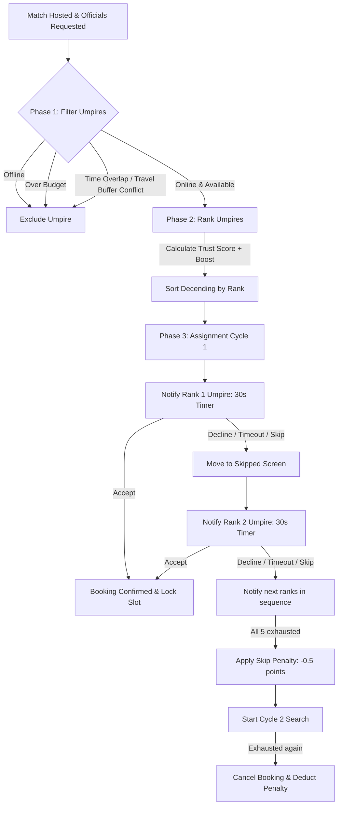

# Umpire Officiating Dispatch & Prioritization Engine

The **Kridaz Umpire Officiating Matcher & Dispatcher Engine** is a real-time system responsible for pairing certified sports officials (Umpires, Referees) with hosted matches. This specification details the four-stage dispatch cycle, trust metrics calculations, and senior-level implementation directives for concurrency, idempotency, and audit trails.


---

## 1. Engine Architecture Workflow

The following flowchart outlines the lifecycle of a dispatch request, traversing filtering gates, prioritization ranking, and notifications cascading:



---

## 2. Phase 1 — Filtering System

Before prioritizing match officials, the engine filters the global pool of umpires using three sequential rules:

### Step 1 — Online Status Check
* **Rule**: The system queries active umpire sessions. Offline umpires are excluded.
* **Implementation**: Relies on a Redis online presence store (`kridaz:online:users`) with heartbeat TTL checks.

### Step 2 — Budget Match
* **Rule**: Evaluates whether the user's budget accommodates the umpire's rates.
* **Calculation**: 
  `Total Fee = Umpire Hourly Rate * Booking Hours`
  
  Exclude the official if `Total Fee > User Match Budget`.

### Step 3 — Conflict & Travel Buffer Checks
* **Rule**: Checks if the umpire has overlapping bookings.
* **Buffer Calculation**: If there is a time gap between the candidate's existing booking and the requested booking, the travel time must be calculated.
  * **Geofenced Travel Time**: `Travel Time = Haversine Distance / Average Speed (Platform Default: 40 km/h)`
  * **Validation Rule**: The gap must be greater than or equal to `Travel Time + Buffer Space` (default: 1 hour). If the gap is insufficient, the accept action is blocked.

---

## 3. Phase 2 — Prioritization Engine

Eligible officials are ranked dynamically. New umpires start with a base trust balance of **100 points**. 

### 3.1 Scoring Parameters
The overall priority score is calculated using these parameters:
1. **Distance to Match Venue**: Closer proximity boosts ranking.
2. **Historical Acceptance Rate**: Ratio of accepted notifications to total dispatched notifications.
3. **Cancellation History**: Track record of late cancellations.
4. **Star Ratings**: Customer feedback average.
5. **Experience Level**: Credentials and total matches officiated.
6. **Urgency**: Shorter time windows to match kick-off apply dynamic multipliers to the scoring query.
7. **New Onboarding Boost**: A temporary priority boost given to newly registered umpires.
   * *Boost Expiry Rule*: The boost expires automatically after the umpire's first **10 bookings** or **30 days** on the platform, whichever comes first.

### 3.2 Tiebreaker
If two umpires share the same priority score, the system prefers the candidate with the higher **Average Daily Active Time** on the platform over the past 30 days.

---

## 4. Phase 3 — Assignment & Real-Time Notification Cascade

The notification cascade handles the sequential offering of bookings to candidates:

1. **The 30-Second Notification**: The booking offer is dispatched to Umpire 1. They have a 30-second window to respond.
2. **Accept**: The slot is reserved and locked, and the candidate gains **+1 point**.
3. **Decline**: The candidate rejects the offer. The request immediately cascades to Umpire 2. No points are deducted.
4. **Skip / No Response**: If the 30-second timer expires without an action, the booking is moved to the umpire's **"Skipped Requests"** screen, and the notification cascades to Umpire 2.
5. **Race Condition Concurrency**: Skipped bookings remain claimable on the "Skipped Requests" screen. However, if Umpire A (who skipped) and Umpire B (who currently has the active 30-second notification) click "Accept" simultaneously, **the currently notified umpire (Umpire B) wins**. Umpire A's attempt returns a notification indicating the slot is no longer available.
6. **Automatic Removal**: Once an umpire accepts the booking, it is instantly removed from all other umpires' "Skipped Requests" screens.
7. **Cycle 1 Exhaustion**: If all 5 ranked umpires skip or decline, a **-0.5 point penalty** is applied to all skipping candidates. The engine automatically initiates **Cycle 2 Search**, notifying the user that the search is ongoing.
8. **Cycle 2 Exhaustion**: If Cycle 2 also fails to find an official, the booking is canceled. Another **-0.5 point penalty** is applied to Cycle 2 skippers, and the host is prompted to schedule at a different time or increase their budget.

---

## 5. Phase 4 — Trust Ledger & Points Matrix

Umpire reliability is tracked via a points system. High points translate to higher dispatch priority:

| Event / Action | Trust Points Impact | Business Rules & Triggers |
| :--- | :---: | :--- |
| **Profile Creation** | `+100` | Initial base balance on onboarding. |
| **Booking Accepted** | `+1` | Applied upon successful session checkout. |
| **Review Received** | `+1` | Applied when customer rating is $\ge 4.0$ stars. |
| **Skip Booking** | `-0.5` | Applied on 30-second notification timeout. |
| **Cancellation (>72 Hrs)**| `-0.5` | Allowed only outside the 72-hour match window. |
| **Cancellation (&lt;72 Hrs)**| *Blocked* | Umpires cannot cancel matches within 72 hours of kick-off. |
| **Rescheduling Exemption**| `0` | If the match host reschedules, the 72-hour window resets. Umpires are not penalized for schedule changes they did not cause. |
| **No-Show** | `-5` | Flagged if the host reports a referee no-show. |
| **Double Skip (Forced Offline)**| *Auto-Offline*| Skipping 2 bookings in a row sets status to `offline`. |
| **Forced Offline Cooldown** | *Toggle Blocked*| Once set offline due to double-skipping, the umpire cannot switch back to `online` for **30 minutes**. |

---

## 6. Implementation Architecture (Developer Directives)

To build a reliable platform, developers must implement the following safeguards:

### 6.1 Concurrency Lock (Compare-and-Swap / SELECT FOR UPDATE)
To prevent race conditions during simultaneous accepts (e.g. from the active notification vs a skipped list re-claim), use a database transaction with a write lock:
* **Database Field**: Add `lockedByUmpireId` and `notifiedUmpireId` to the `Booking` schema.
* **SQL Lock Pattern**:
  ```sql
  -- Atomic state verification block
  BEGIN;
  SELECT id, status, "lockedByUmpireId", "notifiedUmpireId" 
  FROM "Booking" 
  WHERE id = :bookingId FOR UPDATE;
  
  -- If lockedByUmpireId is already populated, fail immediately.
  -- If the accepting umpire is NOT the notifiedUmpireId, check if another active notification exists.
  COMMIT;
  ```

### 6.2 Server-Side Expiry Timers
Do not rely on the client browser or mobile app to manage the 30-second timeout.
* **Scheduler**: Implement a queue scheduler (e.g. **BullMQ** or **Agenda** in Node.js) to schedule a job when a notification is sent.
* **Job Execution**: The job runs after 30 seconds, verifies if the booking is still pending, marks it as `SKIPPED` for the current candidate, and dispatches to the next candidate.

### 6.3 Real-Time WebSocket Push (Preventing Stale UI)
To prevent umpires from seeing and trying to accept already-booked matches on their "Skipped Requests" screen:
* **WebSockets**: Integrate Socket.io. When a booking moves from `PENDING` to `ACCEPTED`, emit a broadcast:
  ```javascript
  io.emit('booking_claimed', { bookingId: booking.id });
  ```
* **Client Handler**: The app intercepts this event and removes the card from the UI.

### 6.4 Estimated vs Maps API Travel Fallbacks
* **Fallback Config**: Implement a feature flag to toggle travel time calculations.
  * `travel_time_source: estimated`: Uses the Haversine distance formula with a 40 km/h speed estimate.
  * `travel_time_source: maps_api`: Queries the Google Distance Matrix API for real-time traffic routing.
* **Platform Variables**: Store the travel buffer time (default: 1 hour) as a global setting key (`officiating_travel_buffer_mins`) rather than hardcoding it in the codebase.

### 6.5 Append-Only Trust Ledger (`TrustEvent`)
Never update the umpire's trust score directly in a single database column without an audit trail.
* **Schema**: Log every point change in a ledger table:
  ```prisma
  model TrustEvent {
    id         String   @id @default(uuid())
    umpireId   String
    eventType  String   // e.g., "BOOKING_ACCEPT", "NO_SHOW"
    delta      Decimal  @db.Decimal(5, 2)
    bookingId  String?
    timestamp  DateTime @default(now())
    umpire     User     @relation(fields: [umpireId], references: [id])
  }
  ```
* **Score Computation**: The active rating score is computed dynamically via `SUM(delta)` or synced periodically to a cached field on the profile.

### 6.6 Booking State Machine
Explicitly restrict status transitions in the database using this state model:

```
          [CREATE] ---> PENDING
                           |
                           v
                        NOTIFIED (Active 30s Window)
                           |
          +----------------+----------------+
          |                                 |
          v                                 v
       SKIPPED                           ACCEPTED
          |                                 |
          v                                 v
   [NEXT NOTIFIED]                      CONFIRMED
                                            |
                         +------------------+------------------+
                         |                                     |
                         v                                     v
                    IN_PROGRESS                            CANCELLED
                         |                                     |
                +--------+--------+                            v
                |                 |                       [REFUND FLOW]
                v                 v
            COMPLETED          NO_SHOW
```

### 6.7 Idempotency Validation (Notification Token)
* **Idempotency Token**: Each notification dispatch generates a unique `notification_token` saved in cache (Redis) with a 35-second TTL.
* **Verification**: The `/api/bookings/accept` endpoint requires this token. If a duplicate call with the same token is received, the server returns the first success response without running the database transaction twice.
