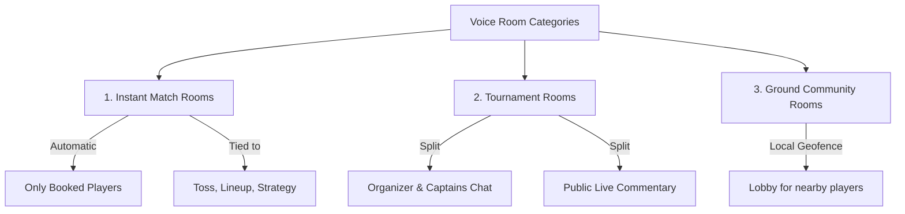

# Live Voice Rooms & Match Audio Architecture

This document describes the design, implementation roadmap, and database schemas for **Kridaz Live Voice Rooms**. 

By introducing contextual, sports-specific live audio spaces—including temporary **Instant Match Rooms**—Kridaz establishes a hybrid ecosystem combining elements of Clubhouse, Discord, and Playo to drive engagement and coordination between athletes.

---

## 1. Contextual Use Cases

Rather than creating a generic, unstructured audio platform, Kridaz voice rooms are directly tied to existing sports entities:



### A. Instant Match Rooms
Auto-generated when a turf/court booking status changes to `CONFIRMED`.
* **Access**: Restricted to players associated with that booking.
* **Value**: Enables pre-match lineup strategy, toss discussions, and post-match banter.
* **Lifecycle**: Automatically expires 2 hours after the booking's scheduled end time.

### B. Tournament Live Rooms
Created dynamically for registered tournaments.
* **Organizer-Only Channel**: For bracket adjustments and scheduling announcements.
* **Captains Room**: For dispute resolution and rules agreements.
* **Spectator Stage**: Public commentary channels where spectators can listen to active match play-by-plays.

### C. Ground Community Rooms
A persistent geofenced lobby room for each individual venue.
* **Access**: Open to local players within a 5-10km radius of the venue.
* **Value**: Used to challenge local teams, recruit last-minute fill-in players, or coordinate pickup games.

---

## 2. Competitive Market Analysis

| Feature | Discord | Clubhouse / Twitter Spaces | Playo / Hudle | Kridaz (Proposed) |
| :--- | :--- | :--- | :--- | :--- |
| **Contextual Linking** | Manual creation. Not tied to real-world bookings. | Completely public, interest-based social circles. | No live audio features. Static chats only. | **Fully automated match linking.** Synced to turf bookings. |
| **Participant Control** | Server roles. | Speaker/Listener states. | N/A | **Booking-verified role mapping** (Organizer, Player, Spectator). |
| **Lifecycle** | Persistent. | Ad-hoc / Ephemeral. | N/A | **Automated expiry cleanup** triggers based on booking end times. |

---

## 3. Relational PostgreSQL Schema (No-JSON Schema)

To store room states relationally in PostgreSQL without unstructured document blocks, we normalize the metadata into three main tables:

```prisma
model VoiceRoom {
  id            String             @id @default(uuid())
  title         String
  type          VoiceRoomType      // MATCH | TOURNAMENT | GROUND
  targetId      String             // Reference ID of Booking, Tournament, or Ground
  hostId        String
  isActive      Boolean            @default(true)
  createdAt     DateTime           @default(now())
  expiresAt     DateTime?          // Populated for MATCH rooms
  
  // Relations
  participants  VoiceRoomParticipant[]
  sessions      VoiceRoomSession[]
}

model VoiceRoomParticipant {
  id            String             @id @default(uuid())
  roomId        String
  userId        String
  joinedAt      DateTime           @default(now())
  leftAt        DateTime?
  isMuted       Boolean            @default(false)
  role          ParticipantRole    @default(LISTENER)

  // Relations
  room          VoiceRoom          @relation(fields: [roomId], references: [id], onDelete: Cascade)

  @@index([roomId, userId])
}

model VoiceRoomSession {
  id                String         @id @default(uuid())
  roomId            String
  channelName       String         // WebRTC room identifier
  rtcProvider       String         // e.g. "livekit" or "agora"
  activeUsersCount  Int            @default(0)

  // Relations
  room              VoiceRoom          @relation(fields: [roomId], references: [id], onDelete: Cascade)
}

enum VoiceRoomType {
  MATCH
  TOURNAMENT
  GROUND
}

enum ParticipantRole {
  HOST
  SPEAKER
  LISTENER
}
```

---

## 4. Technical Architecture & Signaling Flow

Kridaz implements WebRTC SFU-based audio streaming (e.g. via **LiveKit** or **Agora**) combined with a Redis-backed signaling layer.

```text
[Client] ➔ (Socket.IO Connection) ➔ [Signaling API (Node.js/FastAPI)]
    │                                          │
    │ (Join Request)                           │ (Fetches active participants)
    ▼                                          ▼
[Redis Cache (Live Speaker Map)] <────────── [PostgreSQL]
```

### Expiry Daemon
A Celery/BullMQ task runner checks for expired `VoiceRoom` rows (`expiresAt < NOW()`) every 15 minutes, killing active WebRTC channels and setting `isActive = false` in the database.

---

## 5. Implementation System Prompts

Copy-paste these prompts to generate the backend and service layers.

### Prompt: WebRTC Token and Room Signaling Server (FastAPI)
```text
Build a FastAPI endpoint to generate a WebRTC token (using LiveKit or Agora) for a Kridaz sports voice room.
Verify that:
1. The user requesting the token is registered as a participant or organizer for the matching Booking, Ground, or Tournament.
2. The target voice room exists in the PostgreSQL DB and 'isActive' is true.
3. If valid, connect to the Redis active room registry, register the user session, and return the RTC token + WebSocket signaling URL.
```

---

## 6. UI/UX Consistency & Design Uniformity

> [!IMPORTANT]
> **Design Rules for Audio Interfaces**:
> 1. Use the Kridaz primary color (`#84CC16` Lime Green) for active mic waveforms, speaker ring outlines, and join button borders.
> 2. Muted states and inactive participants must use Charcoal Gray (`#1A1A1A` or `#2A2A2A`) to keep visual hierarchies clean.
> 3. Implement subtle micro-animations for active speakers (audio waves rising/falling smoothly).
> 4. Keep the main player cards black (`#000` / `#0A0A0A`) with dark panels (`#121212`) matching `Home.jsx` layouts.
