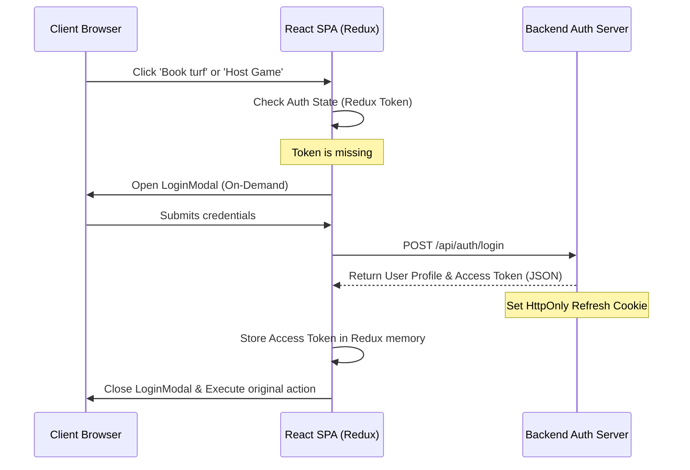

# User Authentication & Session Management

The Kridaz platform features a secure, modern, and high-performance authentication system supporting traditional email/password login and one-click Google OAuth. The system ensures robust session management using short-lived JWT access tokens stored in-memory and long-lived refresh tokens stored securely in cookies, integrated with Redux for reactive state updates.


## Functional Definition

The authentication flow is built to be seamless and context-aware (on-demand):
1. **On-Demand Login:** Users can browse venues, games, and leaderboards without logging in. The system prompts for authentication only when performing write actions (e.g., booking a slot, hosting a game, following a player) via the `useLoginOnDemand` hook.
2. **Standard Auth Modals:** A unified glassmorphic modal handles both login and signup, with quick toggle states.
3. **Onboarding Check:** Upon successful registration or first-time OAuth, the system redirects to an onboarding flow to collect details like sports interests, location, and phone number.
4. **JWT & Session Maintenance:** Access tokens are verified on every API request. A silent refresh mechanism automatically fetches a new access token before expiration.

---

## Key Components & Implementation

The authentication subsystem is implemented across the following core files:

### 1. `LoginModal.jsx`
* **Path:** [LoginModal.jsx](file:///Users/prem/kridaz/client/user/src/shared/components/modals/LoginModal.jsx)
* **Functionality:** Renders the glassmorphic overlay for login and signup. Includes input validation, OAuth button handlers, and links to terms of service.
* **Key Code Snippet:**
  ```javascript
  // Triggering the authentication flow on submission
  const handleSubmit = async (e) => {
    e.preventDefault();
    try {
      setLoading(true);
      const credentials = { email, password };
      const response = await dispatch(loginUser(credentials)).unwrap();
      toast.success(`Welcome back, ${response.user.name}!`);
      onClose();
    } catch (err) {
      toast.error(err.message || "Failed to authenticate");
    } finally {
      setLoading(false);
    }
  };
  ```

### 2. `OnboardingModal.jsx`
* **Path:** [OnboardingModal.jsx](file:///Users/prem/kridaz/client/user/src/shared/components/modals/OnboardingModal.jsx)
* **Functionality:** Prompts newly registered users to complete their profile setup, ensuring critical sports preferences and player levels are recorded.

### 3. `useLoginOnDemand.jsx`
* **Path:** [useLoginOnDemand.jsx](file:///Users/prem/kridaz/client/user/src/shared/hooks/useLoginOnDemand.jsx)
* **Functionality:** A custom React hook that intercepts actions requiring authorization. If the user is unauthenticated, it opens the login modal and buffers the planned action, executing it automatically once auth succeeds.

---

## Logic & Security Flow

The authentication architecture follows best practices for single-page applications:



### Token Lifecycle
* **Access Tokens:** Expire in 15 minutes. Stored in Redux state (`state.auth.token`) to protect against Cross-Site Scripting (XSS).
* **Refresh Tokens:** Expire in 7 days. Stored in a secure, `HttpOnly`, `SameSite=Strict` cookie, preventing client-side JavaScript access.
* **Silent Refresh:** An Axios interceptor catches `401 Unauthorized` errors, automatically requests `/api/auth/refresh`, updates the Redux token, and retries the failed request.

---

## Styling & Design Integration

Following the Kridaz premium design tokens:
* **Background:** Semi-transparent dark cards (`#121212` with `backdrop-filter: blur(12px)`) over a deep black background (`#000000`).
* **Accents:** Neon cyan (`#55DEE8`) is used for primary buttons and text fields focus states, while lime green (`#BFF367`) highlights successful status indicators.
* **Typography:** Clean, high-legibility sans-serif with smooth active transitions (e.g. `transition: all 0.3s ease`).
