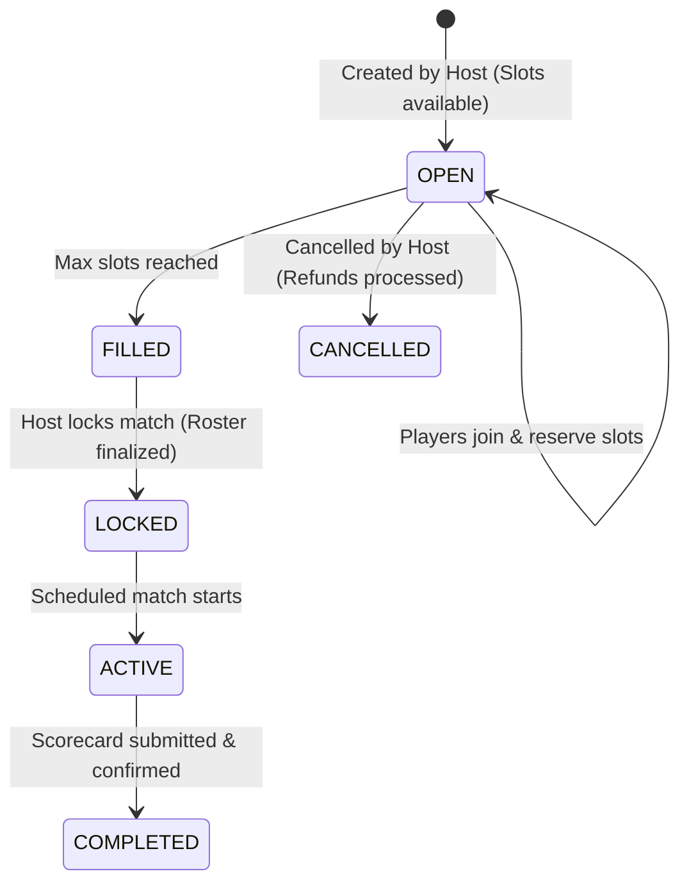

# Hosted & Joined Games

The **Match Hosting & Joining** system serves as the matchmaker for local community sports. Users can host pick-up games, configure rosters (size, positions, cost sharing), share invite links, and join lobbies hosted by other athletes nearby.


## Functional Definition

1. **Host a Game:** Users specify the sport type, date, time slot, turf location, roster limit, skill requirement, and coin division (e.g. split booking costs evenly or free).
2. **Find / Join Lobbies:** A clean grid shows available lobbies matching the player's active locations, indicating vacant player slots, total match fee, and player skill levels.
3. **Coordinated Rosters:** Shows a list of players who have joined. Once the slot limit is reached, the system notifies the host to lock the match and start scheduling referee/scorer services if desired.
4. **Shareable Invite Links:** Generates quick share links for social media to fill remaining slots.

---

## Key Components & Implementation

The matches subsystem is built using these files:

### 1. `HostGame.jsx`
* **Path:** [HostGame.jsx](file:///Users/prem/kridaz/client/user/src/features/games/pages/HostGame.jsx)
* **Functionality:** Displays the multi-step form to configure match types (competitive vs casual), slot availability limits, venue attachments, and fee parameters.
* **Key Code Snippet:**
  ```javascript
  // Form submission in HostGame
  const handleCreateGame = async (formData) => {
    try {
      setLoading(true);
      const payload = {
        sport: formData.sport,
        slots: parseInt(formData.maxSlots),
        date: formData.matchDate,
        time: formData.matchTime,
        costPerPlayer: formData.costSharing ? formData.totalCost / formData.maxSlots : 0,
        venueId: formData.selectedVenueId || null
      };
      const response = await axiosInstance.post('/api/games/host', payload);
      toast.success("Match hosted successfully!");
      navigate('/games/my-hosted');
    } catch (error) {
      toast.error(error.response?.data?.message || "Failed to host match");
    } finally {
      setLoading(false);
    }
  };
  ```

### 2. `JoinGames.jsx`
* **Path:** [JoinGames.jsx](file:///Users/prem/kridaz/client/user/src/features/games/pages/JoinGames.jsx)
* **Functionality:** Fetches public matches based on user filters and presents them in a card grid using the `GameCard` component.

### 3. `MyHostedGames.jsx` & `MyJoinedGames.jsx`
* **Paths:** [MyHostedGames.jsx](file:///Users/prem/kridaz/client/user/src/features/games/pages/MyHostedGames.jsx) / [MyJoinedGames.jsx](file:///Users/prem/kridaz/client/user/src/features/games/pages/MyJoinedGames.jsx)
* **Functionality:** Tabs allowing the user to manage games they've created (e.g. approve joins, cancel matches) or games they've signed up to play.

### 4. `GameDetailsModal.jsx`
* **Path:** [GameDetailsModal.jsx](file:///Users/prem/kridaz/client/user/src/features/games/components/GameDetailsModal.jsx)
* **Functionality:** The modal overlay showing full roster details, host info, venue directions, game rules, and slot booking CTA.

---

## Lobby Lifecycle Flow

Matches proceed through the following operational phases:



---

## Styling & Design Integration

* **Slot Progress Bar:** Indicates vacancy levels using a progress bar styled in neon cyan (`#55DEE8`) with a smooth fill transition.
* **Accents:** Game status tags use lime green (`#BFF367`) for "Open" statuses and warning amber/red for "Almost Full" or "Locked".
* **Layout Grid:** Displayed as a responsive grid (`grid grid-cols-1 md:grid-cols-2 lg:grid-cols-3 gap-6`) using modern card elements with a slight shadow glow.
