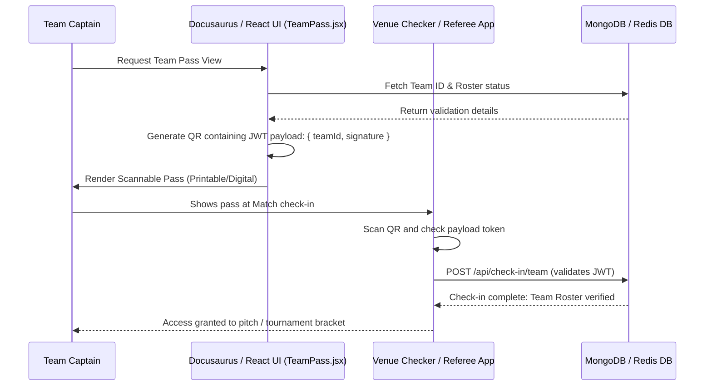

# Team Management & Team Pass

The **Teams** system enables athletes to form clubs, manage rosters, send invitations to prospective teammates, track team statistics, and print a digital **Team Pass** to verify registration at tournament venues.


## Functional Definition

1. **Club Management:** Team owners can upload team logos, edit description banners, and assign roster roles (e.g. Captain, Vice Captain, Member).
2. **Teammate Recruitment:** Captains invite players to join the roster via username search or direct share links.
3. **Team Statistics:** Tracks overall performance (total matches, wins, losses, win streaks, and average team rating).
4. **Team Pass:** A digital ticket interface containing a QR code representing the team. Scanning the code registers the entire roster at physical matches and tournament checkpoints.

---

## Key Components & Implementation

The teams feature set is implemented within the following files:

### 1. `Teams.jsx`
* **Path:** [Teams.jsx](file:///Users/prem/kridaz/client/user/src/features/teams/pages/Teams.jsx)
* **Functionality:** Renders the main directory of user-created teams, invitations inbox, and the CTA button to trigger team creation.

### 2. `TeamProfile.jsx`
* **Path:** [TeamProfile.jsx](file:///Users/prem/kridaz/client/user/src/features/teams/pages/TeamProfile.jsx)
* **Functionality:** Provides the dashboard view for a single team. Lists members, player positions, stats, and handles direct edits by team managers.
* **Key Code Snippet:**
  ```javascript
  // Inviting a member to the team
  const inviteMember = async (targetUserId) => {
    try {
      setSendingInvite(true);
      const res = await axiosInstance.post(`/api/teams/${teamId}/invite`, { userId: targetUserId });
      toast.success("Teammate invitation sent!");
      // Refresh pending list
      setPendingInvites(prev => [...prev, res.data.invite]);
    } catch (error) {
      toast.error(error.response?.data?.message || "Failed to send invitation");
    } finally {
      setSendingInvite(false);
    }
  };
  ```

### 3. `TeamPass.jsx`
* **Path:** [TeamPass.jsx](file:///Users/prem/kridaz/client/user/src/features/teams/pages/TeamPass.jsx)
* **Functionality:** Formats a ticket-themed graphic representation of the team, complete with a scannable QR code and roster list. Includes basic printing styling rules.

### 4. `CreateTeamModal.jsx`
* **Path:** [CreateTeamModal.jsx](file:///Users/prem/kridaz/client/user/src/features/teams/components/CreateTeamModal.jsx)
* **Functionality:** A glassmorphism form configuration wizard to name the club, assign a home sport, upload logo assets, and select initial team founders.

---

## Technical & QR Verification Flow

The **Team Pass** verification flow operates as follows:



---

## Styling & Design Integration

* **Digital Ticket Card:** The `TeamPass.jsx` utilizes a design with rounded side cuts resembling a perforated movie ticket.
* **Brand Colors:** Main headers are colored using the brand gradient (`#55DEE8` to `#BFF367`) styled over flat `#121212` backgrounds.
* **Responsive Layout:** Sidebar roster components collapse to standard full-width panels on screens under 768px (`flex-col md:flex-row`).
