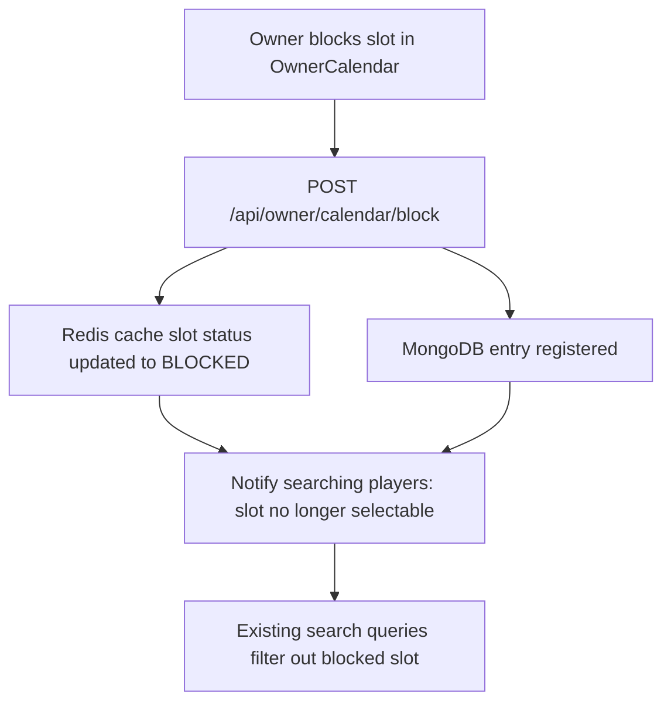

# Venue Owner Dashboard

The **Venue Owner Dashboard** is the operations control center for facility owners on the Kridaz platform. It provides a comprehensive set of management tools to track booking revenue, configure turf dimensions, manage booking calendar schedules in real-time, block slots for maintenance, and engage with customer reviews.


## Functional Definition

1. **Revenue Analytics & Reports:** Visually displays earnings, booking volumes, busiest hours, and slot utilization rates using glowing interactive charts.
2. **Interactive Booking Calendar:** A CSS-Grid scheduling calendar where owners can view reservations, drag-and-drop bookings, and click to manually block pitches for offline events or grounds maintenance.
3. **Turf Asset Configuration:** Lets owners add, edit, and disable individual courts, pitches, or lanes, specifying sports compatibility, lighting capability, and pricing tiers per hour.
4. **Escrow Settlements:** Displays wallet balances, pending escrow coins from upcoming matches, and options to request bank payouts.

---

## Key Components & Implementation

The business dashboard features are implemented in the following codebase files:

### 1. `OwnerDashboard.jsx`
* **Path:** [OwnerDashboard.jsx](file:///Users/prem/kridaz/client/user/src/features/venue-owner/Dashboard/OwnerDashboard.jsx)
* **Functionality:** Renders the main dashboard layout, key stats cards (Total Bookings, Active Turf Count, Net Revenue), and active billing alerts.

### 2. `OwnerCalendar.jsx` & `OwnerBookings.jsx`
* **Paths:** [OwnerCalendar.jsx](file:///Users/prem/kridaz/client/user/src/features/venue-owner/Calendar/OwnerCalendar.jsx) / [OwnerBookings.jsx](file:///Users/prem/kridaz/client/user/src/features/venue-owner/Bookings/OwnerBookings.jsx)
* **Functionality:** The calendar management layouts. Syncs turf slots with the database, handles drag actions to move slots, and schedules manual overrides.
* **Key Code Snippet:**
  ```javascript
  // Handle blocking a specific calendar slot
  const blockCalendarSlot = async (pitchId, timeSlot, date) => {
    try {
      setSubmitting(true);
      const payload = {
        pitchId: pitchId,
        date: date,
        time: timeSlot,
        reason: "Manual Block (Maintenance)"
      };
      await axiosInstance.post('/api/owner/calendar/block', payload);
      toast.success("Calendar slot blocked successfully");
      // Reload calendar state
      refreshCalendar();
    } catch (err) {
      toast.error(err.response?.data?.message || "Failed to block slot");
    } finally {
      setSubmitting(false);
    }
  };
  ```

### 3. `OwnerRevenue.jsx`
* **Path:** [OwnerRevenue.jsx](file:///Users/prem/kridaz/client/user/src/features/venue-owner/Revenue/OwnerRevenue.jsx)
* **Functionality:** Integrates charting packages (like Recharts) to render visual lines, area charts, and bar diagrams reflecting daily and monthly earnings statistics.

### 4. Custom Hooks (`shared/hooks/owner/`)
* **Paths:**
  - [useOwnerDashboard.jsx](file:///Users/prem/kridaz/client/user/src/shared/hooks/owner/useOwnerDashboard.jsx)
  - [useOwnerBookings.jsx](file:///Users/prem/kridaz/client/user/src/shared/hooks/owner/useOwnerBookings.jsx)
  - [useOwnerRevenue.js](file:///Users/prem/kridaz/client/user/src/shared/hooks/owner/useOwnerRevenue.js)
* **Functionality:** Abstracts query functions and keeps dashboard screens updated via react-query or local sync patterns.

---

## Technical Maintenance Flow

When an owner blocks a slot manually, the system updates slot availability dynamically:



---

## Styling & Design Integration

* **Glassmorphic Calendar:** The scheduling grid is styled using thin `#1E1E1E` borders, translucent containers (`backdrop-filter: blur(10px)`), and custom colors to denote slots:
  - **Occupied Slot:** Translucent blue background with matching text.
  - **Blocked Slot:** Slanted grey striping pattern to indicate offline status.
  - **Available Slot:** Deep grey blank area with subtle hover borders.
* **Accents:** High-level analytics widgets and cards use primary cyan (`#55DEE8`) and lime green (`#BFF367`) highlights to draw focus to critical business figures.
