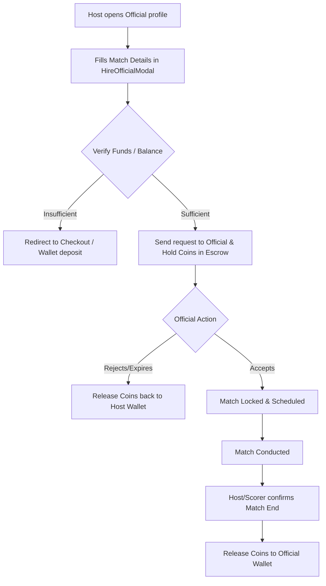

# Hiring Sports Professionals

To elevate match quality and competitive integrity, Kridaz provides a marketplace where event hosts and team captains can hire certified sports professionals. This includes verified **Coaches, Umpires, Commentators, and Scorers** available for local tournaments, friendlies, or coaching masterclasses.


## Functional Definition

1. **Category Directories:** Filterable lists grouped by official roles (e.g., cricket umpires, football referees, tennis coaches, live stream commentators).
2. **Professional Profile Cards:** Highlights certifications, match experiences, rating scores, hourly rates, and sports categories.
3. **Availability Calendar:** Displays the professional's schedule slots synced directly from their personal dashboard.
4. **Hiring Flow:** Hosts specify the match date, time, venue, and pay details. Once confirmed, payment is securely reserved and held in escrow until the match is marked completed.

---

## Key Components & Implementation

The marketplace and scheduling tools are built with the following files:

### 1. `HireOfficialModal.jsx`
* **Path:** [HireOfficialModal.jsx](file:///Users/prem/kridaz/client/user/src/shared/components/official/HireOfficialModal.jsx)
* **Functionality:** Handles the hiring configuration wizard. Lets the user input dates, time windows, choose matching bookings, and see final service cost calculations.
* **Key Code Snippet:**
  ```javascript
  // Processing official booking request submission
  const handleHireSubmit = async () => {
    if (!selectedBooking && !customVenue) {
      toast.error("Please associate a venue or booking slot");
      return;
    }
    try {
      setSubmitting(true);
      const requestPayload = {
        officialId: official.id,
        bookingId: selectedBooking?.id,
        durationHours,
        dateTime: matchTime,
        totalFees: official.ratePerHour * durationHours
      };
      const res = await axiosInstance.post('/api/professionals/hire', requestPayload);
      toast.success("Hiring request sent to official!");
      onClose();
    } catch (err) {
      toast.error(err.response?.data?.message || "Hiring request failed");
    } finally {
      setSubmitting(false);
    }
  };
  ```

### 2. `SelectVenueModal.jsx`
* **Path:** [SelectVenueModal.jsx](file:///Users/prem/kridaz/client/user/src/shared/components/official/SelectVenueModal.jsx)
* **Functionality:** Allows the match host to link the official's booking directly to one of their pre-reserved ground slots or choose a public/external venue location.

### 3. `ProfessionalLayout.jsx` & `ProfessionalSidebar.jsx`
* **Paths:** [ProfessionalLayout.jsx](file:///Users/prem/kridaz/client/user/src/shared/layouts/ProfessionalLayout.jsx) / [ProfessionalSidebar.jsx](file:///Users/prem/kridaz/client/user/src/shared/components/layout/ProfessionalSidebar.jsx)
* **Functionality:** The dashboard layout and navigation sidebar used by professionals to view incoming requests, log match reports, configure banking payouts, and set their shift availability calendars.

---

## Hiring Logic Flow

The booking and payment flow follow this lifecycle:



---

## Styling & Design Integration

* **Card Grids:** Structured in css grid layouts (`grid grid-cols-1 md:grid-cols-3 gap-6`) using rich `#121212` backgrounds.
* **Rating Stars:** Colored in vibrant yellow/gold (`#FBBF24`), with a soft glowing back shadow to indicate exceptional ratings.
* **Interactive Pills:** Action buttons utilize the brand gradient (transitioning from `#55DEE8` to `#BFF367`) with strong hover offsets (`hover:-translate-y-0.5 transition-transform`).
