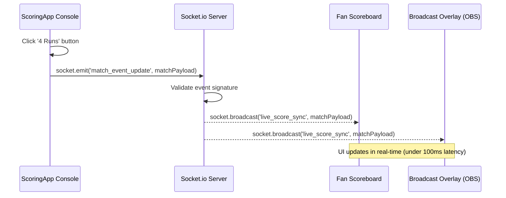

# Live Match Scoring

The Kridaz **Live Scoring System** is a tablet-optimized scoring console that allows scorers, coaches, and umpires to log matches ball-by-ball. This real-time match progression engine syncs score updates instantly to public scoreboards, fan apps, and OBS video production overlays using WebSockets.


## Functional Definition

1. **Ball-by-Ball Logging:** Dynamic button panels allow logging runs (0, 1, 2, 3, 4, 6), extras (Wides, No Balls, Leg Byes, Byes, Penalties), and wickets (Bowled, Caught, LBW, Run Out, Stumped).
2. **Innings Configuration:** Modals coordinate opening batsman line-ups, bowler assignments, toss declarations, and maximum overs settings.
3. **Live Websocket Broadcaster:** Runs a background socket connection that pushes match state events (e.g. `BALL_BOWLED`, `WICKET_FALL`) immediately to client screens.
4. **Broadcast Overlays:** Outputs direct web-source URLs (`/scoring/overlay/:matchId`) optimized for OBS/vMix, displaying live scores, batsman metrics, and bowler cards in styled animated graphics.

---

## Key Components & Implementation

The scoring engine contains the following files:

### 1. `ScoringApp.jsx`
* **Path:** [ScoringApp.jsx](file:///Users/prem/kridaz/client/user/src/features/scoring/pages/ScoringApp.jsx)
* **Functionality:** The core controller for scoring interfaces. Connects button events to state modifiers and dispatches socket sync payloads.

### 2. `useCricketScoring.js`
* **Path:** [useCricketScoring.js](file:///Users/prem/kridaz/client/user/src/features/scoring/hooks/useCricketScoring.js)
* **Functionality:** A React state hook managing complex innings score formulas, run rate computations, striker/non-striker transitions, and undo/redo stacks.
* **Key Code Snippet:**
  ```javascript
  // Processing a run-scoring event
  const registerRuns = (runs, isExtra = false) => {
    dispatchScoreAction({
      type: 'ADD_BALL',
      payload: {
        runs: runs,
        isExtra: isExtra,
        strikerId: activeStriker.id,
        bowlerId: activeBowler.id,
      }
    });
    // Send event to websocket server for live clients
    socket.emit('match_event_update', {
      matchId: match.id,
      currentScore: scoreState.totalRuns + runs,
      wickets: scoreState.wickets,
      overs: scoreState.overs
    });
  };
  ```

### 3. `LiveScoreboard.jsx` & `LiveOverlay.jsx`
* **Paths:** [LiveScoreboard.jsx](file:///Users/prem/kridaz/client/user/src/features/scoring/pages/LiveScoreboard.jsx) / [LiveOverlay.jsx](file:///Users/prem/kridaz/client/user/src/features/scoring/pages/LiveOverlay.jsx)
* **Functionality:** Public-facing pages displaying live scorecards and clean, chroma-keyable graphics overlays (e.g., green screen backdrops) for stream broadcasters.

### 4. Setup Modals
* **Paths:**
  - [InningsSetupModal.jsx](file:///Users/prem/kridaz/client/user/src/features/scoring/components/InningsSetupModal.jsx)
  - [WicketModal.jsx](file:///Users/prem/kridaz/client/user/src/features/scoring/components/WicketModal.jsx)
  - [ExtraRunsModal.jsx](file:///Users/prem/kridaz/client/user/src/features/scoring/components/ExtraRunsModal.jsx)
* **Functionality:** Handles selection logic during gameplay changes (e.g. identifying who got caught/run out, or logging penalty runs).

---

## Live Socket Data Flow



---

## Styling & Design Integration

* **High-Visibility Console:** Uses large, touch-friendly pads with distinct borders to prevent accidental taps by field-side scorers.
* **Colors:**
  - **Runs Buttons:** Dark slate backgrounds with neon cyan (`#55DEE8`) text numbers.
  - **Wicket Button:** Deep dark red with solid red glow accent.
  - **Extra Action Pills:** Translucent blue tags with white text labels.
* **Overlays:** Broadcast overlays feature clean typography (e.g. Google Font Orbitron or Inter), smooth entrance animations, and glassmorphic ticker lines to provide a professional television-network look.
